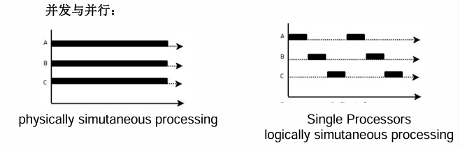
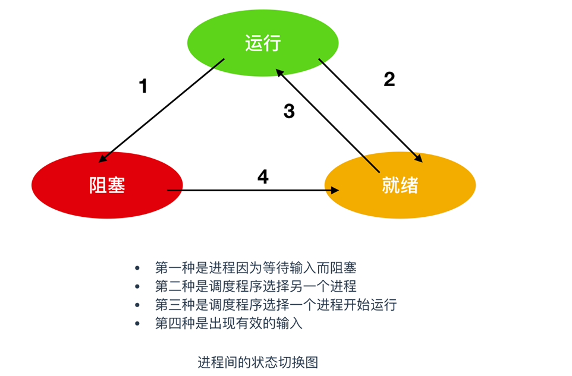

# 操作系统复习指南

本指南根据2025版王道操作系统编写，并且补充了一些比较容易考察到的知识点，知识点并不全，只是收录一些容易遗漏的知识点

## 计算机系统概述

### 操作系统四大特性

虚拟、<font color=red>并发</font>、共享、异步

### 并发和并行的区别

并发和并行的区别就很明显了。它们虽然都说是“<font color=red>多个进程同时运行</font>”，但是它们的“同时”不是一个概念。<font color=red>并行的“同时”是同时刻可以多个进程在运行（处于running）</font>，并发的“同时”是经过<font color=red>上下文快速切换</font>，使得看上去多个进程同时都在运行的现象，是一种OS欺骗用户的现象。



单处理机系统中，可并行的是：处理机与设备、处理机与通道、设备与设备。只是不能多个进程并行

操作系统提供给应用程序的接口是<font color=red>系统调用</font>。操作系统接口主要有命令接口和程序接口（也称<font color=red>系统调用</font>）。库函数是高级语言中提供的与系统调用对应的函数（也有些库函数与系统调用无关），目的是隐藏“访管”指令的细节，使系统调用更为方便、抽象。但是，库函数属于用户程序而非系统调用，是系统调用的上层

### 库函数与系统调用的区别和联系

库函数是语言或应用程序的一部分。可以运行在用户空间中。系统调用是操作系统的一部分，是内核为用户提供的程序接口，运行在内核空间中，并且许多库函数都使用系统调用来实现功能。未使用系统调用的库函数，其执行效率通常要比系统调用的高。因为使用系统调用时，需要上下文的切换及状态的转换（由用户态转向核心态）

### 开机过程

存储设备的引导记录（Boot Record）载入内存，并执行引导记录中的引导程序（Boot）—>引导程序会将存储设备中的操作系统内核载入到<font color=red>内存</font>—>操作系统初始化

### 批处理阶段

批处理系统分为<font color=red>单道批处理系统</font>和<font color=red>多道批处理系统</font>

中断技术使得多道批处理系统的I/O设备可与CPU并行工作（中断技术使得并发性）

#### 多道程序系统的优点

CPU利用率高、系统吞吐量大、I/O设备利用率高

具有并发和并行的特点；需要对共享资源的保护；不必支持虚拟存储管理

但是进程数越多并不一定使得CPU利用率越高，可能会导致死锁使得CPU利用率降低

### 操作系统的运行环境

#### 特权指令

特权指令是一类只能在<font color=red>核心态</font>下执行的指令，涉及到对系统资源的<font color=red>底层操作和管理，例如修改内存映射、访问输入/输出端口、修改特殊寄存器等</font>。只有处于核心态的操作系统内核或特权模式的代码才能执行特权指令

#### 非特权指令

非特权指令是可以在<font color=red>用户态</font>下执行的指令，它们通常涉及到<font color=red>一般的计算、数据操作和控制流程等操作。大部分应用程序都运行在用户态</font>，并使用非特权指令进行常规的计算和处理

### 操作系统管理的部分

#### 时钟管理

确保<font color=red>系统内时钟同步，时间片轮转调度</font>，操作系统可以为系统的<font color=red>各个事件和资源分配时间戳</font>，以便跟踪和记录事件的发生顺序

#### 中断机制

属于操作系统内核的是<font color=red>中断处理程序</font>，中断处理程序运行在<font color=red>内核态（核心态）</font>下，具有更高的权限级别和对系统资源的完全访问权限。它可以执行<font color=red>特权指令</font>，访问和操作受限资源，修改内存映射等核心操作。因为中断服务例程需要处理底层硬件和系统操作，所以它必须在内核态下执行

#### 原语

<font color=red>要么全部完成，要么完全不执行</font>。常见的原语有锁（Lock）、信号量（Semaphore）和条件变量（Condition Variable）

#### 进程管理

内存管理，文件系统，设备驱动器

### 用户态切换到内核态

1）用户程序要求重装系统的服务，即<font color=red>系统调用</font>

2）发生一次<font color=red>中断</font>

3）用户态中产生了一个<font color=red>错误状态</font>

4）用户程序中企图执行一条<font color=red>特权指令</font>

### 内核态切换到用户态

从内核态转向用户态由一条指令实现，这条指令也是<font color=red>特权指令</font>，一般是<font color=red>中断返回指令</font>

### 内核态执行的指令

内核态下，CPU可执行任何指令，而特权指令只能在内核态下执行

常见的<font color=red>特权指令</font>：有关对I/O设备操作的指令；有关访问程序状态的指令；存取特殊寄存器指令；其他指令

### 用户态执行的指令

用户态下只能执行<font color=red>非特权指令</font>，例如trap指令、数据传送指令；设置断点指令

### 系统调用

系统调用是操作系统提供给用户程序的接口，系统调用发生在用户态，被调用程序在核心态下执行(区分<font color=red>在用户态发生和在用户态执行的区别</font>)

## 进程与线程

操作系统的**最基本特性**是<font color=red>并发性</font>和<font color=red>共享性</font>

### 进程的组成

进程是一个独立的运行单位，也是操作系统进行**资源分配**和**调度**的**基本单位**。它由以下三部分组成，其中最核心的是**进程控制块**（PCB）

**进程实体**由<font color=red>程序段</font>、<font color=red>相关数据段</font>和<font color=red>PCB</font>组成

### 进程状态

#### 区分

##### 挂起

将数据结构从内存搬移到**磁盘**，等待某些条件满足后可以被重新恢复。这通常出现在需要腾出内存资源或者某些条件暂时不满足时

##### 阻塞

等待时间发生 任务在内存。当进程在**某些外部事件（如I/O操作完成、锁释放）**时，进入阻塞状态。这个状态下，进程无法继续执行，操作系统将不会为其分配CPU时间

##### 运行

当进程获得CPU资源，并且正在执行其指令时，它处于运行状态。操作系统将进程调度到CPU上，运行它执行任务

##### 就绪

当一个进程已经具**备执行的所有条件**，但尚未获得CPU时，它就处于就绪态。这意味着它准备好执行，但操作系统还没有为其分配CPU（<font color=red>就绪态只缺一个CPU</font>）

#### 三状态模型

##### 运行态

此状态表明进程当前正实际占用CPU的时间片进行执行。

##### 就绪态

就绪态的进程已准备好执行，但由于CPU资源正被其他进程占用， 因此它暂时处于等待CPU时间片的状态。

##### 阻塞态

阻塞态的进程因等待某个外部事件（如I/O操作完成、信号量释 放等）而无法继续执行。除非该事件发生，否则即使CPU空闲，该进程也无法运行。



### 线程

**优势**

主要优势在于它们能够**共享同一地址块**。这意味着线程可以直接访问进程中的全局变量、静态变量以及通过指针或引用访问的区域，而无需进行进程间通信（IPC）的复杂操作

### 进程和线程的主要区别

#### 资源分配

**进程**：是操作系统资源分配的基本单位，每个进程有独立的内存空间和资源

**线程**：是进程内的执行单位，多个线程共享进程的资源（如内存、文件句柄等）

#### 开销

**进程**：常见和切换的开销大，因为每个进程都有独立的资源和内存

**线程**：开销小，线程间切换更快，因为它们共享进程

#### 内存空间

**进程**：进程之间有独立的内存空间，不能直接共享数据

**线程**：同一进程的线程共享内存空间，可以直接共享数据

#### 通信方式

**进程**:进程之间的通信需要使用复杂的进程间通信（IPC）机制

**线程**：线程之间通信简单，因为它们共享相同的地址空间

### CPU调度

#### 高级调度（作业调度）

按照某种规则从外存上处于后备队列的作业中挑选一个（或多个），给它（们）分配内存、I/O设备等必要的资源，并建立相应的进程，以使它（们）获得竞争CPU的权利。

负责从<font color=red>创建态</font>转换到<font color=red>就绪态</font>

#### 中级调度（内存调度）

引入中级调度的目的是<font color=red>提高内存利用率和系统吞吐量</font>。为此，将那些暂时不能运行的进程调至外存等待，此时进程的状态称为**挂起态**。当它们已具备运行条件且内存又稍有空闲时，由中级调度来决定将外存上的那些已经具备运行条件的挂起进程再重新调入内存，并修改为**就绪态**，挂在就绪队列上等待。中级调度实际上是<font color=red>存储器管理中的对换功能</font >。

#### **低级调度（进程调度）**

按照某种算法从就绪队列中选取一个进程，将CPU分配给它。进程调度是<font color=red>最基本</font>的一种调度，在各种操作系统中都必须配置这级调度。进程调度的频率很高，一般几十毫秒一次

### 进程同步

进程因为需要协调它们的运行<font color=blue>（先后）次序</font>而等待、传递消息所产生的制约关系。同步关系源于进程之间的相互合作

同步是指协调多个线程或进程的执行顺序，以确保它们按照预期的顺序访问共享资源或完成某些任务。同步主要关注的是**线程之间的顺序和时序关系**。

### 进程互斥

互斥是一种用于防止多个线程或进程同时访问共享资源（如变量、文件、设备等）的机制。其核心目标是确保在任何给定时刻，**只有一个线程能够访问特定的资源**，从而避免竞态条件

当一个进程进入临界区使用临界资源时，另一个进程必须等待，当占用临界资源的进程退出临界区后，另一进程才允许去访问此临界资源

对于临界资源的互斥访问，可以在逻辑上分为如下四个部分

```c++
do{
    enrty section	// 进入区
    critical section	// 临界区  访问临界资源的那段代码
    exit section	// 退出区
   	remainder section	// 剩余区
} while(true)
```

**注意**：
<font color=red>临界区</font>是进程中<font color=red>访问临界资源</font>的代码段

<font color=red>进入区</font>和<font color=red>退出区</font>是<font color=red>负责实现互斥</font>的代码段

<font color=blue>临界资源</font>是一次仅允许一个进程使用的资源，许多物理设备都属于临界资源，如打印机等，此外，还有许多变量、数据等都可以被若干进程共享，也属于临界资源

### 实现临界区互斥必须遵守的准则

为禁止两个进程同时进入临界区，同步机制应遵循以下准则：

#### 1）空闲让进

临界区空闲时，可以允许一个请求进入临界区的进程立即进入临界区

#### 2）忙则等待

当已有进程进入临界区时，其他试图进入临界区的进程必须等待

#### 3）有限等待

对请求访问的进程，应保证能在有限时间内进入临界区，防止进程无限等待

#### 4）让权等待

当进程不能进入临界区时，应立即释放处理器，防止进程忙等待

### 实现临界区互斥的基本方法

#### 软件实现方法

单标志法、双标志先检查法、双标志后检查法、Peterson算法

#### 硬件实现方法

中断屏蔽法、硬件指令方法（TestAndSet指令）、Swap指令

### 管程

管程是由一组数据及定义在这组数据之上的对这组数据的操作组成的软件模块，这组操作能初始化并改变管程中的数据和同步进程。管程不仅能实现进程间的<font color=red>互斥</font>，而且还能实现进程之间的<font color=red>同步</font>

管程是由编程语言支持的进程同步机制，任何时候只能有一个进程在管程中执行，管程中定义的变量只能被管程内的过程访问

### 死锁

#### 预防死锁

##### 破坏性条件

将临界资源改造为可共享使用的资源（如SPOOLing资源）

**缺点**：可行性不高，很多时候无法破坏互斥条件

##### 破坏不剥夺条件

**方案一**，申请的资源得不到满足时，立即释放拥有的所有资源（<font color=red>主动释放</font>）

**方案二**，申请的资源被其他进程占用时，有操作系统协助剥夺（考虑优先级）

##### 破坏请求和保持条件

运行前分配好所有需要的资源，之后一直保持

**缺点**：资源利用率低；可能导致饥饿

##### 破坏循环等待条件

给资源编号，必须按编号从小到大的顺序申请资源

**缺点**：不方便增加新设备；会导致资源浪费；用户编程麻烦

#### 银行家算法

1）检查此次申请是否超过了之前声明的最大需求数

2）检查此时系统剩余的可用资源是否还能满足这次请求

3）试探着分配，更改各数据结构、

4）用安全性算法检查此次分配是否会导致系统进入不安全状态

#### 安全性算法

检查当前的剩余可用资源是否能满足某个进程的最大需求，如果可以，就把该进程加入安全序列，并把该进程持有的资源全部回收。

不断重复上述过程，看最终是否能让所有进程都加入安全序列

#### 破坏死锁

一旦检测出死锁的发生，就应该立即解除死锁

**补充**：并不是系统中所有的进程都是死锁状态，用死锁检测算法<font color=red>化简资源分配图后，还连着边的那些进程就是死锁进程</font>

解除死锁的主要方法有：

<font color=red>资源剥夺法</font>：挂起（暂时放到外存上）某些死锁进程，并抢占它的资源，将这些资源分配给其他的死锁进程。但是应防止被挂起的进程长时间得不到资源而饥饿

<font color=red>撤销进程法</font>（或称<font color=red>终止进程法</font>）。强制撤销部分、甚至全部死锁进程，并剥夺这些进程的资源。这种方式的优点是实现简单，但所付出的代价可能会很大。因为有些进程可能已经运行了很长时间，已经接近结束了，一旦被终止可谓功亏一篑，以后还得从头再来

<font color=red>进程回退法</font>。让一个或多个死锁进程回退到足以避免死锁的地步。这就要求记录进程的历史信息，设置还原点

## 内存管理

### 内存的基础知识

### **从写程序到程序运行**

#### 编译

由编译程序将用户源代码编译成若干个目标模块（编译就是把高级语言<font color=red>翻译为机器语言</font>）

#### 链接

由链接程序将编译后形成的一组目标模块，以及所需库函数链接在一起，形成一个完整的装入模块

##### 静态链接

##### 装入时动态链接

在程序运行前，先将各个目标模块及它们所需的库函数连接成一个完整的可执行文件（装入模块）之后不再拆开

##### 运行时动态链接

将各个目标模块装入内存时，边装入边链接的链接方式

##### 运行时动态链接

在程序执行中需要该目标模块时，才对它进行链接。其有点是便于修改和更新，便于实现对目标模块的共享

#### 装入（装载）

由装入程序将装入模块装入内存运行

##### 绝对装入

在编译时，如果知道程序将放到内存中的哪个位置，编译程序将产生的绝对地址的目标代码，装入程序按照装入模块中的地址，将程序和数据装入内存

编译、链接后得到的装入模块的指令直接就使用了绝对地址

绝对装入只适用于<font color=red>单道程序环境</font>

##### 可重定位装入

<font color=red>静态重定位</font>，又称<font color=red>可重定位装入</font>。编译、链接后的装入模块的地址都是从0开始的，指令中使用的地址、数据存放的地址都是相对于起始地址而言的逻辑地址。可根据内存的当前情况，将装入模块装入到内存的适当位置。装入时对地址进行“<font color=red>重定位</font>”，将逻辑地址变换为物理地址（地址变换是在装入时一次完成的）

静态重定位的特点是在的特点是在一个作业装入内存时，<font color=red>必须分配器要求的全部内存空间</font>，如果没有足够的内存，就不能装入该作业。作业一旦进入内存后，<font color=red>在运行期间就不能再移动</font>，也不能再申请内存空间

##### 动态重定位

<font color=red>动态重定位</font>，又称<font color=red>动态运行时装入</font>。编译、链接后的装入模块的后，并不会立即把逻辑地址转换为物理地址，而是<font color=red>把地址转换推迟到程序真正要执行时才运行</font>。因此装入内存后所有的地址依然是逻辑地址。这种方式需要一个<font color=red>重定位寄存器</font>的支持

采用动态重定位时<font color=red>****允许程序在内存中发生移动****</font>。并且可将程序分配到不连续的存储区中；在程序运行前只需装入它的部分代码即可投入运行，然后在程序运行期间，根据需要动态申请分配空间；便于程序段的共享，可以向用户提供一个比存储空间大得多的地址空间

**重定位寄存器**

存放装入模块存放的<font color=red>起始位置</font>

### 地址转换

操作系统作为系统资源的管理者，当然也需要对内存进行管理

操作系统负责***内存空间的分配与回收***

操作系统需要提供某种技术从逻辑上***对内存空间进行扩充***

操作系统需要提供地址转换功能，负责程序的<font color=red>逻辑地址</font>与<font color=red>物理地址</font>的转换
为了使编程更方便，程序员写程序时应该只关注指令、数据的逻辑地址。而<font color=red>逻辑地址到物理地址的转换</font>（这个过程称为<font color=red>地址重定位</font>）应该由操作系统负责，这样就保证了程序员写程序时不需要关注物理内存的实际情况

### 内存保护

内存保护可采取两种方法：

#### 方法1

在CPU中<font color=red>设置一对上、下限寄存器</font>，存放进程的上、下限地址。进程的指令要访问某个地址时，CPU检查是否越界。

#### 方法2

采用<font color=red>重定位寄存器</font>（又称为<font color=red>基址寄存器</font>）和<font color=red>界地址寄存器</font>（又称<font color=red>限长寄存器</font>）进行越界检查。重定位寄存器中存放的是进程的<font color=red>起始物理地址</font>。界地址寄存器中存放的是进程的<font color=red>最大逻辑地址</font>

### 覆盖技术

<font color=red>覆盖技术</font>，用来<font color=red>解决“程序大小超过物理内存总和”的问题</font>

#### 覆盖技术的思想

将<font color=red>程序分为多个段</font>（多个模块）。常用的段常驻内存，不常用的段在需要时调入内存。

内存中分为<font color=red>一个“固定区”</font>和<font color=red>若干个“覆盖区”</font>

需要常驻内存的段放在<font color=red>“固定区”</font>中，<font color=red>调入后就不再调出（除非运行结束）</font>

不常用的段放在<font color=red>“覆盖区”</font>，<font color=red>需要用到时调入内存，用不到时调出内存</font>

### 交换技术

#### 交换（对换）技术的设计思想

内存空间紧张时，系统将内存中某些进程暂时<font color=red>换出</font>外存，把外存中已具备运行条件的进程<font color=red>换入</font>内存（进程在内存与磁盘间动态调度）

暂时换出外存等的进程状态为<font color=red>挂起状态（挂起态，suspend）</font>

挂起态又可以进一步细分为<font color=red>就绪挂起</font>、<font color=red>阻塞挂起</font>两种状态

### 动态分区分配

<font color=red>动态分区分配</font>又称为<font color=red>可变分区分配</font>。这种分配方式<font color=red>不会预先划分内存分区</font>，而是在进程装入内存时，<font color=red>根据进程的大小动态地建立分区</font>，并使分区的大小正好适合进程的需要。因此系统分区的大小和数目是可变的。

动态分区分配<font color=red>没有内部碎片</font>，但是有<font color=red>外部碎片</font>。

<font color=red>内部碎片</font>，分配给某进程的内存区域中，如果有些部分没有用上

<font color=red>外部碎片</font>，是指内存中的某些空闲分区由于太小而难以利用

如果内存中空间的总和本来可以满足某进程的要求，但由于进程需要的是一整块连续的内存空间，因此这些“碎片”不能满足进程的需求

可以通过<font color=red>紧凑（拼凑，Compaction）</font>技术来解决外部碎片

### 动态分区分配算法

| 算法     | <font color=red>算法思想</font>                              | 分区排列顺序                                   | 优点                                                         | 缺点                                                         |
| -------- | ------------------------------------------------------------ | ---------------------------------------------- | ------------------------------------------------------------ | ------------------------------------------------------------ |
| 首次适应 | <font color=red>从头到尾找适合的分区</font>                  | 空闲分区以地址递增次序排列                     | 综合看性能最好、***算法开销小***，回收分区后一般不需要对空闲分区队列重新排序 |                                                              |
| 最佳适应 | <font color=red>优先使用更小的分区，以保留更多大分区</font>  | 空闲分区以容量递增次排列                       | 会有更多的大分区被保留下来，更能满足大进程需求               | 会产生很多太小的、难以利用的碎片；***算法开销大***，回收分区后可能需要对空闲分区队列重新排序 |
| 最坏适应 | <font color=red>优先使用更大的分区，以防止产生太小的不可用的碎片</font> | 空闲分区以容量递减次序排列                     | 可以减少难以利用的小碎片                                     | 大分区容易被用完，不利于大进程；***算法开销大***（原因同上） |
| 邻近适应 | <font color=red>由首次适应演变而来，每次从上次查找结束为止开始查找</font> | 空闲分区以地址递增次序排列（可排列成循环链表） | 不用每次都从低地址的小分区开始检索。***算法开销小***（原因同首次适应算法） | 会使高地址的大分区也被用完                                   |

### 分页存储

将内存空间分为一个个大小相等的分区（比如：每个分区4KB），每个分区就是一个“页框”（页框=页帧=内存块=物理块=物理页面）。每个页框有一个编号，即“页框号”（页框号=页帧号=内存块号=物理块号=物理页号），页框号从0开始

将进程的逻辑地址空间也分为与页框大小相等的一个个部分，每个部分称为一个“页”或“页面”。每个页面也有一个编号，即“页号”，页号也从0开始

操作系统以页框为单位为各个进程分配内存空间。进程的每个页面分贝放入一个页框中。也就是说，进程的页面与内存的页框有一一对应的关系。

各个页面不必连续存放，可以放到不相邻的各个页框中

## 文件管理

## 输入/输出（I/O）管理

