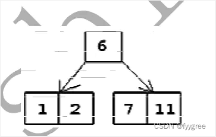
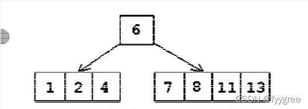
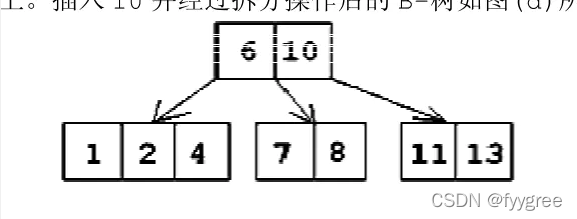
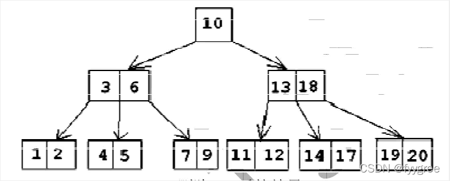
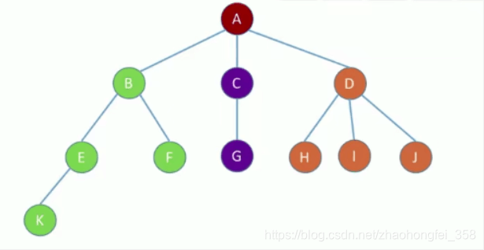
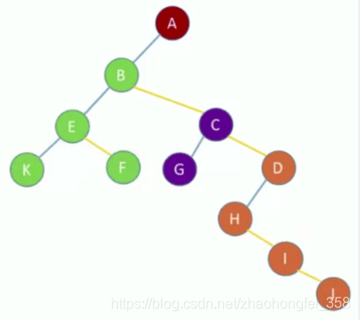
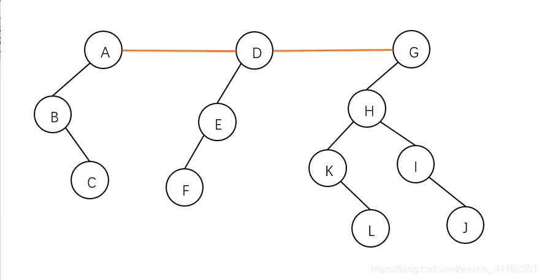

# 数据结构复习指南

本文中列举了数据结构期末考试可能存在的考点

## 绪论

### 数据的基本单位

数据元素是数据的基本单位

### 数据项

数据项是组成数据的、有独立含义的、不可分割的**最小单位**。

### 数据对象

数据对象是性质相同的数据元素的集合，是数据的一个子集。

### 数据结构的三要素

逻辑结构、存储结构（物理结构）、数的操作

#### 逻辑结构

1）集合结构

2）线性结构

3）树结构

4）图结构

### 存储结构

1）顺序存储结构

2）链式存储结构

### 抽象数据类型（ADT）

具体包含3个部分：数据对象、数据对象上关系的集合以及对数据对象的基本操作的集合。

### 算法的定义及特性

1）**有穷性**：一个算法必须总是执行有穷步后结束，且每一步都必须在有穷时间内完成。

2）**确定性**：对于每种情况下所应执行的操作，在算法中都有确切的规定，不会产生二义性，算法的执行者或阅读者都能明确其含义及如何执行。

3）**可行性**：算法中的所有操作都可以通过将已经实现的基本操作运算执行有限次来实现。

4）**输入**：一个算法有0个或多个输入。当用函数描述算法时，输入往往通过形参表示，在它们被调用时，从主函数获得输入值。

5）**输出**：一共算法有一个或多个输出。它们是算法进行信息加工后得到的结果，无输出的算法没有任何意义。当用函数描述算法时，输出多用返回值或引用类型的形参表示。

### 评价算法优劣的基本标准

1）正确性

2）可读性

3）健壮性

4）高效性

## 顺序表和链表

### 顺序表的主要缺点

扩容成本太高

### 删除给出链表结点的指针（非尾结点），最有效的方法

将下一个结点的数据和指针复制到当前结点，然后删除下一个结点。

## 时间复杂度

## 平均查找长度

平均查找长度：$ASL=\sum_{i=1}^{n}P_iC_i$

其中n是查找表的长度；$P_i$是查找第$i$个元素的概率，一般认为每个数据元素的查找概率相等，即$P_i=1/n$；$C_i$是查找第$i$个元素所需要进行的比较次数。平均查找长度是衡量查找算法效率的最主要的指标。

### 顺序查找

顺序查找的平均查找长度：

$ASL_{成功}=\sum_{i=1}^nP_i(n-i+1)=\frac{n+1}{2}$

$ASL_{不成功}=n+1$

### 折半查找

折半查找的平均查找长度：

$ASL_{成功}=\frac{1}{n}(1\times2^0+2\times2^1+...+h\times2^{h-1})$(最后一个不一定等于$2^{h-1}$，根据整个元素数量变化)

其中，h是树高，并且元素个数为n时，树高$h=\lceil log_2{(n+1)}\rceil$表示是向上取整。

则当长度为11时，h=4,

则$ASL=(1\times1+2\times2+3\times4+4\times4)/11=3$

折半查找的精髓是画判定树

#### 折半查找失败的情况

折半查找在查找不成功时和给定值进行关键字的比较次数最多为树高，即$\left\lceil log_2(n+1) \right\rceil$

#### 折半查找判定树

画出查找路径图，因为折半查找判定树是一颗平衡二叉树（也是二叉排序树），看其是否满足二叉排序树的要求。

#### 判断一棵树是否是折半查找判定树

判断是向上取整还是向下取整，即是左少右多，还是左多右少，**需要求值算法一直保持一致**，此外，碰到对称的树的结构直接排除掉，应该是部分应该是重合（如果结点数相同的话）。

除此之外，如果结点数是奇数，则左右子树结点数相等。如果结点数是偶数，则左右子树结数不等。

## 排序算法

对于绝大部分内部排序而言，只适用于顺序存储结构。快速排序在排序的过程中，既要从后往前查找，也要从前往后查找，因此宜采用顺序存储。

1.直接插入排序 2.希尔排序 3.简单选择排序 4.堆排序 5.冒泡排序 6.快速排序 7.二路归并排序

（1）每一趟排序中，都至少能够确定好一个元素最终位置的方法有哪几个？

共4个

**3.直接选择 4.堆排序 5.冒泡排序 6.快速排序**

（2）稳定的算法是哪几个？

共2个

**1.直接插入 5.冒泡排序**

### 待排序元素基本有序

在待排序元素基本有序时，最好使用**插入排序**。插入排序在处理几乎已经有序的数组时效率非常高，其时间复杂度接近 O(n)。这是因为插入排序在遇到基本有序的数组时，每个元素只需比较少量其他元素即可找到其正确位置，从而减少了整体的操作次数。

### 插入排序

**基本思想是每次将一个待排序的记录按其关键字大小插入前面已排好序的子序列，直到全部记录插入完成**

折半插入排序与直接插入排序都将待插入元素插入到前面的有序子表，区别是：确定当前在前面有序子表中的位置，直接插入排序采用顺序查找法，而折半插入排序采用折半查找法。折半插入排序的比较次数与序列初态无关，时间复杂度为$O(nlog_2n)$；而直接插入排序的比较次数与序列初态有关，时间复杂度为$O(n)\sim~O(n^2)$。

#### 直接插入排序

步骤:

1)查找出L(i)在L[l...i-1]中的插入位置k。

2)将L[k...i-1]中所有元素依次后移一个位置。

3)将L(i)复制到L(k)。

##### 代码

```C++
void insertionSort(int arr[], int n) {
    // 从数组的第二个元素开始，因为第一个元素默认是已排序的
    for (int i = 1; i < n; i++) {
        int key = arr[i];  // 当前待插入的元素
        int j = i - 1;

        // 从已排序部分的末尾开始向前扫描，找到插入位置
        while (j >= 0 && arr[j] > key) {
            arr[j + 1] = arr[j];  // 将元素右移
            j = j - 1;
        }
        arr[j + 1] = key;  // 将待插入元素放到正确位置
    }
}
```

##### 时间复杂度

$O(n^2)$

##### 空间复杂度

由于仅使用了常数个辅助单元$O(1)$

##### 稳定性

**稳定**

#### 折半插入排序

相比较直接插入排序，折半插入排序是在查找待插入元素的位置的地方做出了改变，即先折半查找出元素的待插入位置，然后统一地移动待插入位置之后的所有元素。不难看出折半插入排序仅减少了比较元素的次数。

##### 代码

```C++
// 折半插入排序函数
void binaryInsertionSort(int arr[], int n) {
    for (int i = 1; i < n; i++) {
        int key = arr[i];  // 当前待插入的元素
        int low = 0;
        int high = i - 1;

        // 使用二分查找找到插入位置
        while (low <= high) {
            int mid = low + (high - low) / 2; // 避免溢出的计算方式
            if (key < arr[mid]) {
                high = mid - 1;
            } else {
                low = mid + 1;
            }
        }

        // 将元素右移，为插入腾出空间
        for (int j = i - 1; j >= low; j--) {
            arr[j + 1] = arr[j];
        }
        arr[low] = key;  // 将元素插入到正确位置
    }
}

```

##### 时间复杂度

$O(nlog_n)$

##### 稳定性

不稳定

#### 希尔排序

希尔排序的基本思想是：先将待排序表分割成若干形如L[i,i+d,i+2d,...i+kd]的“特殊”子表，即把某个“增量”的记录组成一个子表，对各个子表分别进行直接插入排序，当整个表中的元素“基本有序”时，再对全体记录进行一次直接插入排序。

**希尔排序的组内排序**：采用的是直接插入排序。

##### 空间复杂度

仅使用了常数个辅助单元，因而空间复杂度为$O(1)$

##### 时间复杂度

最坏的情况是$O(n^2)$

##### 稳定性

**不稳定**

### 交换排序

#### 冒泡排序

冒泡排序的基本思想是：从后往前（或从前往后）两两比较相邻元素的值，若为逆序（即A[i-1]>A[i]）,则交换它们，直到序列比较完。我们称它为第一趟冒泡，结果是将最小的元素交换到待排序的第一个位置，下一趟冒泡时，前一趟确定的最小的元素不参与比较，每趟的冒泡结果是把序列中的最小元素放到最终位置，这样最多做n-1趟冒泡就能把所有元素排完。

##### 代码

```C++
// 冒泡排序函数
void bubbleSort(int arr[], int n) {
    // 外层循环控制排序的轮数
    for (int i = 0; i < n - 1; i++) {
        // 内层循环控制每一轮比较的次数
        for (int j = 0; j < n - i - 1; j++) {
            // 如果前一个元素大于后一个元素，则交换它们
            if (arr[j] > arr[j + 1]) {
                int temp = arr[j];
                arr[j] = arr[j + 1];
                arr[j + 1] = temp;
            }
        }
    }
}
```

##### 空间复杂度

仅使用了常数个辅助单元，因而空间复杂度为$O(1)$

##### 时间复杂度

平均时间复杂度为$O(n^2)$

##### 稳定性

由于i>j且A[i]=A[j]时，不会发生交换，因此冒泡排序是一种**稳定**的排序算法

#### 快速排序

##### 快速排序对应的最好情况

快速排序对应的最好情况为：每次划分使两个子序列长度大致相等。

快速排序的**基本思想**是基于分治法的：在待排序表L[1...n]中任取一个元素pivot作为枢轴，通过一趟排序将待排序表划分为独立的两部分L[1...k-1]和L[k+1...n]，使得L[1...k-1]中的所有元素小于pivot，L[k+1..n]中的所有元素大于或等于pivot，则pivot放在了其最终位置L(k)上，这个过程称为一次划分。然后分别递归地对两个子表重复上述过程，直至每部分内只有一个元素或为空为止，即所有元素放在了其最终位置。

**快速排序性质：**对n个元素进行第一趟快速排序后，会确定一个基准元素，根据这个基准元素在数组中的位置，有两种情况：

1）基准元素在数组的首段或尾端，接下来对剩下n-1个元素构成的子序列进行第二趟快速排序，再确定一个一个基准元素。这样，在两趟排序后就至少能确定两个元素构成的最终位置，其中至少有一个元素是在数组的首段或尾端。

2）基准元素不在数组的首端或尾端，第二趟快速排序对基准元素划分开的两个子序列分别进行一次划分，两个子序列各确定一个基准元素。这样，两趟排序后就至少能确定三个元素的最终位置。

##### 快速排序的过程

需要自己模拟一下

例如数据序列（<strong>42</strong>,76,157,137,93,24,159,12,121,11）

第一趟快速排序的结果：

11,12,24,<font color="red">42</font>,93,137,159,157,121,76

所以一趟快排可以至少确定一个元素的位置

##### 空间复杂度

由于快排是递归的，因此需要借助一个递归工作栈来保存每层递归用的必要信息，其容量与递归调用的最大层数一致，平均情况下，栈的深度为$O(log_2n)$

##### 时间复杂度

$O(nlog_2n)$,快速排序是所有内部排序算法中平均性能最优的排序算法。

##### 稳定性

在划分算法中，若右端区间有两个关键字相同，且均小于基准值的记录，则在交换的左区间后，它们的相对位置会发生变化，即快速排序是一种**不稳定**的算法。

### 选择排序

#### 简单选择排序

简单选择排序算法的思想：假设排序表为L[1...n]，第i趟排序即从L[i...n]中选择关键字最小的元素与L(i)交换，每一趟排序可以确定一个元素的最终位置，这样经过n-1趟排序就可使得整个排序表有序。

##### 代码

```C++
// 简单选择排序函数
void selectionSort(int arr[], int n) {
    for (int i = 0; i < n - 1; i++) {
        // 假设当前循环中，最小元素的索引为i
        int minIndex = i;

        // 找到剩余部分中最小元素的索引
        for (int j = i + 1; j < n; j++) {
            if (arr[j] < arr[minIndex]) {
                minIndex = j;
            }
        }

        // 将最小元素与当前位置的元素交换
        if (minIndex != i) {
            int temp = arr[i];
            arr[i] = arr[minIndex];
            arr[minIndex] = temp;
        }
    }
}
```

##### 空间复杂度

仅使用常数个辅助单元，所以空间复杂度为$O(1)$

##### 时间复杂度

$O(n^2)$

##### 稳定性

在第i趟找到最小元素后，和第i个元素交换，可能会导致第i个元素与含有相同关键字的元素的相对位置发生改变。因此，简单选择排序是一种**不稳定**的排序算法。

### 堆排序

堆排序的思想：首先将存放在L[1...n]中的n个元素建成初始堆，因为堆本身的特定，所以堆顶元素就是最大值。输出堆顶元素后，通常将堆顶元素送入堆顶，此时根结点已不满足大顶堆的性质，堆被破坏，将堆顶元素向下调整使其继续保持大顶堆的性质，再输出堆顶元素。如此重复，直到堆中仅剩一个元素为止。

#### 构建初始大根堆

要熟练掌握建堆和调整堆的方法，**从序列末尾开始向前遍历**。

建堆的过程是层次插入，并且不断进行调整的过程。

##### 大根堆的一些性质

1）可以将堆视为一颗完全二叉树

2）可以采用顺序存储方式保存堆

3）堆中的次大值一定在根的下一层

##### 空间复杂度

仅使用常数个辅助单元，所以空间复杂度为$O(1)$

##### 时间复杂度

堆排序的时间复杂度为$O(nlog_2n)$

##### 稳定性

进行筛选时，有可能把后面相同关键字的元素调整到前面，所以堆排序算法是一种**不稳定**的排序算法

## 各种内部排序算法的比较及应用

### 稳定性

**从稳定性看：**<strong><font color="red">插入排序</font></strong>、<strong><font color="red">冒泡排序</font></strong>、归并排序和基数排序是稳定的排序算法，而简单选择排序、快速排序、希尔排序和堆排序都是不稳定的排序算法。

### 适用性

**从适用性看：**折半插入排序、希尔排序、快速排序和堆排序适用于顺序排序。直接插入排序、冒泡排序、简单选择排序、基数排序即适用于顺序存储，又适用于链式存储。

### 过程性

**从过程特征看：**采用不同的的排序算法，在一趟或者几趟处理后的排序结果通常是不同的，考研题中经常出现给出一个待排序的初始序列和已部分排序的序列，问采用何种排序算法。这就要对各类排序算法的过程特征十分熟悉，如冒泡排序、简单选择排序和堆排序在每趟处理后都能产出当前的最大值或最小值，而快速排序一趟处理至少能确定一个元素的最终位置等。

### 直接插入排序和简单选择排序的比较

对大部分元素已经有序的数组排序时，直接插入排序比简单选择排序效率更高，因为直接插入排序过程中元素之间的比较次数更少。

### 直接插入排序和快速排序的毕竟

|                  | 适合初始序列情况 | 适合元素数量 | 空间复杂度  | 稳定性 |
| ---------------- | ---------------- | ------------ | ----------- | ------ |
| **直接插入排序** | 大部分元素有序   | 较少         | $O(1)$      | 稳定   |
| **快速排序**     | 基本无序         | 较多         | $O(log_2n)$ | 不稳定 |

## 二叉树

### 树度的概念

 度为<font color="red"><strong>节点的子女个数</strong></font>，可以看作几个出边就是几个度，叶子节点没有度

**任何一颗二叉树的叶子结点在先序、中序、后序遍历序列中的相对次序是不发生改变的**

前序序列和后序序列不能唯一确定一棵二叉树，但可以确定二叉树中结点的祖先关系：当两个结点的前序序列为$XY$与后序序列为$YX$时，$X$为$Y$的祖先。

### 卡特兰数

$$
\frac{C_{2n}^n}{n+1}
$$

<font color="red">**计算用途：二叉树形态数，出栈序列数**</font>

#### 卡特兰数的应用

1.**一个栈(无穷大)的进栈序列为1，2，3，…，n，有多少个不同的出栈序列？**

2.**n个节点构成的二叉树，共有多少种情形？**

解答：

答案都是
$$
\frac{C_{2n}^n}{n+1}
$$
要使一棵非空二叉树的先序序列与中序序列相同，其所有非叶结点需满足的条件是：**只有右子树**

### 表达式转化为二叉树

要将算数表达式转化为二叉树，需要用到表达式树算法，步骤如下：

1.从左到右扫描中缀表达式，遇到操作数创建一个叶子结点，值为该操作数。

2.遇到操作数，创建一个新结点，将当前操作符存储在新结点中。

3.将新结点插入到栈的顶部。

4.当扫描到右括号，弹出栈中的元素，直到找到左括号。

5.将括号内的所有结点组成一个子树，插入栈的顶部。

6.重复步骤1-5，直到扫描完整个表达式。

7.最后栈中只剩下一个结点，即为根结点，返回该结点即可。

### 满二叉树

一棵高度为h，且有$2^h-1$个结点的二叉树称为**满二叉树**（$2^h-1=(2^0+2^1+...+2^{h-1})$）

可以对满二叉树按层次编号：如果从根节点下标为1开始起，则对于编号为i的节点，若有双亲，则双亲为$\left\lfloor \frac{i}{2} \right\rfloor$(向下取整)，若有左孩子，则左孩子为2i；若有右孩子，则右孩子为2i+1。如果根节点下标为0开始，则对于编号为i的节点。若有双亲，则双亲$\left\lfloor \frac{i - 1}{2} \right\rfloor$（向下取整），若有左孩子，则左孩子为2i+1；若有右孩子，则右孩子为2i+2。

### 完全二叉树

高度为h、有n个结点的二叉树，当且仅当其每个结点都与高度为h的满二叉树编号为1~~n的结点一一对应时，称为满二叉树。

完全二叉树中，$n_1$只能取1或0。

### 二叉链表存储树

二叉链表存储树是**孩子兄弟表示法**，即根结点的右指针是空。

### 二叉树的性质

非空二叉树上的叶结点数等于度为2的结点数加1，即$n_0=n_2+1$

**证明**

$n=n_0+n_1+n_2$

$n=n_1+2n_2$

非空二叉树的第k层最多有$2^{k-1}$个结点（$k\geq1$）

高度为h的二叉树至多有$2^h-1$个结点$h\geq1$(当二叉树变成满二叉树时)

### 二叉树的递归遍历

二叉树的递归遍历算法中，递归遍历左、右子树的顺序都是固定的，只是访问根结点的顺序不同。不管采用哪种算法，每个结点都访问一次且仅访问一次，所以时间复杂度是$O(n)$。在递归遍历中，递归工作栈的栈深度恰好为树的深度，所以在最坏的情况下，二叉树有n个结点且深度为n的单支树，遍历算法的空间复杂度为$O(n)$。

### 二叉树的非递归遍历

#### 先序非递归遍历

先右后左

当栈不为空时，执行以下步骤：

1. 从栈中弹出一个节点，并访问该节点（打印节点的值）。
2. 如果该节点的右子节点存在，则将右子节点压入栈中。
3. 如果该节点的左子节点存在，则将左子节点压入栈中。

重复上述步骤

##### 代码

```C++
// 非递归先序遍历函数
void preorderTraversal(TreeNode* root) {
    if (root == NULL) return;  // 检查根节点是否为空

    stack<TreeNode*> stack;
    stack.push(root);

    while (!stack.empty()) {
        TreeNode* current = stack.top();
        stack.pop();

        cout << current->val << " ";  // 访问节点

        // 先将右子节点压入栈中
        if (current->right != NULL) {
            stack.push(current->right);
        }

        // 再将左子节点压入栈中
        if (current->left != NULL) {
            stack.push(current->left);
        }
    }
}
```

#### 中序非递归遍历

访问过程：

1）沿着根的左孩子，依次入栈，直到左孩子为空，说明已经找到可以输出的结点

2）栈顶元素出栈并访问：若其右孩子为空，继续执行${\small II}$

3）若其右孩子不空，将右子树继续执行$I$

##### 代码

```C++
// 非递归中序遍历函数
void inorderTraversal(TreeNode* root) {
    stack<TreeNode*> stack;
    TreeNode* current = root;

    while (current != NULL || !stack.empty()) {
        // 遍历左子树
        while (current != NULL) {
            stack.push(current);
            current = current->left;
        }

        // 访问节点
        current = stack.top();
        stack.pop();
        cout << current->val << " ";

        // 遍历右子树
        current = current->right;
    }
}
```

### 层次遍历

层次遍历思想：

1）首先将二叉树的根结点入队。

2）若队列非空，则队头结点出队，访问该结点，若它有左孩子，则将左孩子入队；若它有右孩子，则将右孩子入队。

3）重复2的步骤，直至队列空。

##### 代码

```C++
// 层次遍历函数
void levelOrderTraversal(TreeNode* root) {
    if (root == NULL) return;  // 检查根节点是否为空

    queue<TreeNode*> q;
    q.push(root);

    while (!q.empty()) {
        TreeNode* current = q.front();
        q.pop();

        cout << current->val << " ";  // 访问节点

        // 将左子节点压入队列
        if (current->left != NULL) {
            q.push(current->left);
        }

        // 将右子节点压入队列
        if (current->right != NULL) {
            q.push(current->right);
        }
    }
}
```

## 线索二叉树

空指针总数为$n_0+n_1+n_2+1=n+1$

现有⼀棵结点数⽬为n的⼆叉树，采⽤⼆叉链表的形式存储。对于每个结点均有指向左右孩⼦的 两个指针域，⽽结点为n的⼆叉树⼀共有n-1条有效分⽀路径。那么，则⼆叉链表中存在2n-(n-1)=n+1个 空指针域，则有n-1个非空指针域。

### 中序线索二叉树

1）求中序线索二叉树的中序序列下的第一个结点：

从根节点一直往左走，找到第一个没有左孩子的结点，则该结点为中序序列下的第一个结点。

2）求中序线索二叉树中结点p在中序序列下的后继

如果rtag==1则直接返回后继线索，否则找到右子树下最左下的结点

3）求中序线索二叉树中结点p在中序序列下的前驱

如果ltag==1则直接返回前驱线索，否则找到左子树下最右边的结点。

## 二叉排序树（BST）

### 特性

1）若左子树非空，则左子树上所有结点的值均小于根结点的值。

2）若右子树非空，则右子树上所有结点的值均大于根结点的值。

3）左、右子树也分别是一棵二叉排序树。

因此对二叉排序树进行中序遍历，可以得到一个递增的有序序列。

### 二叉排序树的查找

二叉排序树的查找是从根结点开始，沿某个分支逐层向下比较的过程。若二叉排序树非空，先将给定值与根结点的关键字比较，若相等，则查找成功；若不等，若小于根结点的关键字，则在根结点的左子树上查找，否则在根结点的右子树上查找。这显然是个递归的过程。

```c++
TreeNode* searchBST(TreeNode* root, int target) {
    TreeNode* current = root;
    while (current != NULL) {
        if (current->val == target) {
            return current;
        } else if (target < current->val) {
            current = current->left;
        } else {
            current = current->right;
        }
    }
    return NULL;
}
```

## 平衡二叉树

先找到最小不平衡子树再进行调整。

### 调整操作

结合课本上的几个例子进行复习：

LL平衡旋转（左旋）：左孩子（L）的左子树（L）上插入了新的结点

RR平衡旋转（右旋）：右孩子（R）的右子树（R）上插入了新的结点

LR平衡旋转（先局部左旋，变成LL，再整体右旋）：左孩子（L）的右子树（R）上插入了新的结点

RL平衡旋转（先局部右旋，变成RR，再整体左旋）：右孩子（R）的左子树（L）上插入了新的结点

### 性质

若所有非叶子1结点的平衡因子均为1，即平衡二叉树满足平衡的最少结点情况。对于高度为n、左右子树的高度分别为n-1和n-2、所有非叶子结点的平衡因子均为1的平衡二叉树，计算总结点数的公式为
$$
C_n=C_{n-1}+C_{n-2}+1
$$
初始已知$C_1$=1，$C_2$=2，根据递推表达式可以求解任意层数的结点总数。

## B树

一棵m阶B树或为空树，或为满足如下特性的m叉树：

1）树中每个结点至多有m棵树，即至多m-1个关键字。

2）若根结点不是叶结点，则至少有2棵子树，即至少有1个关键字。

3）除根结点外的所有非叶结点至少有$\lceil \frac{m}{2} \rceil$(向上取整)棵子树，即至少有$\lceil\frac{m}{2}\rceil-1$个关键字。

4）所有叶结点都在同一层

5）各结点内关键字均升序或降序排列

### B树的插入

与二叉排序树一样，B-树的创建过程也是将关键字逐个插入到树中的过程。
在进行插入之前，要确定一下每个结点中关键字个数的范围，如果B-树的阶数为m，则结点中关键字个数的范围为ceil(m/2)-1 ~ m-1个。
对于关键字的插入，需要找到插入位置。在B-树的查找过程中，当遇到空指针时，则证明查找不成功，同时也找到了插入位置，即根据空指针可以确定在最底层非叶结点中的插入位置，为了方便，我们称最底层的非叶结点为**终端结点**，由此可见，B-树结点的插入总是落在终端结点上。在插入过程中有可能破坏B-树的特征，如新关键字的插入使得结点中关键字的个数超过规定个数，这是要进行**结点的拆分**。

接下来，我们以关键字序列{1,2,6,7,11,4,8,13,10,5,17,9,16,20,3,12,14,18,19,15}创建一棵5阶B-树，我们将详细体会B-树的插入过程。
（1）确定结点中关键字个数范围
由于题目要求建立5阶B-树，因此关键字的个数范围为2～4
（2）根结点最多可以容纳4个关键字，依次插入关键字1、2、6、7后的B-树如下图所示：


（3）当插入关键字11的时候，发现此时结点中关键字的个数变为5，超出范围，需要拆分，去关键字数组中的中间位置，也就是k[3]=6，作为一个独立的结点，即新的根结点，将关键字6左、右关键字分别做成两个结点，作为新根结点的两个分支，此时树如下图所示：



（4）新关键字总是插在叶子结点上，插入关键字4、8、13之后树为：



（5）关键字10需要插入在关键字8和11之间，此时又会出现关键字个数超出范围的情况，因此需要拆分。拆分时需要将关键字10纳入根结点中，并将10左右的关键字做成两个新的结点连在根结点上。插入关键字10并经过拆分操作后的B-树如下图：



（6）插入关键字5、17、9、16之后的B-树如图所示：


（7）关键字20插入在关键字17以后，此时会造成结点关键字个数超出范围，需要拆分，方法同上，树为：


（8）按照上述步骤依次插入关键字3、12、14、18、19之后B-树如下图所示：


（9）插入最后一个关键字15，15应该插入在14之后，此时会出现关键字个数超出范围的情况，则需要进行拆分，将13并入根结点，13并入根结点之后，又使得根结点的关键字个数超出范围，需要再次进行拆分，将10作为新的根结点，并将10左、右关键字做成两个新结点连接到新根结点的指针上，这种插入一个关键字之后出现多次拆分的情况称为连锁反应，最终形成的B-树如下图所示：


### B树的删除

若被删结点是叶结点，则显然会导致叶结点变化；若被删结点不是叶结点，则要先将被删结点和它的前驱或后继交换，最终还是导致叶结点的变化

#### 具体的删除操作

对于B-树关键字的删除，需要找到待删除的关键字，在结点中删除关键字的过程也有可能破坏B-树的特性，如旧关键字的删除可能使得结点中关键字的个数少于规定个数，这是可能需要向其兄弟结点**借关键字**或者和其孩子结点进行**关键字的交换**，也可能需要进行**结点的合并**，其中，和当前结点的孩子进行关键字交换的操作可以保证删除操作总是发生在终端结点上。

我们用刚刚生成的B-树作为例子，一次删除8、16、15、4这4个关键字。
（1）删除关键字8、16。关键字8在终端结点上，并且删除后其所在结点中关键字的个数不会少于2，因此可以直接删除。关键字16不在终端结点上，但是可以用17来覆盖16，然后将原来的17删除掉，这就是上面提到的和孩子结点进行关键字交换的操作。这里不能用15和16进行关键字交换，因为这样会导致15所在结点中关键字的个数小于2。因此，删除8和16之后B-树如下图所示：


（2）删除关键字15，15虽然也在终端结点上，但是不能直接删除，因为删除后当前结点中关键字的个数小于2。这是需要向其兄弟结点借关键字，显然应该向其右兄弟来借关键字，因为左兄弟的关键字个数已经是下限2.借关键字不能直接将18移到15所在的结点上，因为这样会使得15所在的结点上出现比17大的关键字，所以正确的借法应该是先用17覆盖15，在用18覆盖原来的17，最后删除原来的18，删除关键字15后的B-树如下图所示：



（3）删除关键字4，4在终端结点上，但是此时4所在的结点的关键字个数已经到下限，需要借关键字，不过可以看到其左右兄弟结点已经没有多余的关键字可借。所以就需要进行关键字的合并。可以先将关键字4删除，然后将关键字5、6、7、9进行合并作为一个结点链接在关键字3右边的指针上，也可以将关键字1、2、3、5合并作为一个结点链接在关键字6左边的指针上，如下图所示：


显然上述两种情况下都不满足B-树的规定，即出现了非根的双分支结点，需要继续进行合并，合并后的B-树如下图所示：


有时候删除的结点不在终端结点上，我们首先需要将其转化到终端结点上，然后再按上面的各种情况进行删除。在讲述这种情况下的删除方法之前，要引入一个相邻关键字的概念，对于不在终端结点的关键字a，它的相邻关键字为其左子树中值最大的关键字或者其右子树中值最小的关键字。找a的相邻关键字的方法为：沿着a的左指针来到其子树根结点，然后沿着根结点中最右端的关键字的右指针往下走，用同样的方法一直走到叶结点上，叶结点上的最右端的关键字即为a的相邻关键字（这里找的是a左边的相邻关键字，我们可以用同样的思路找到a右边的相邻关键字）。可以看到下图中a的相邻关键字是d和e，要删除关键字a，可以用d来取代a，然后按照上面的情况删除叶子结点上的d即可。

## B+树

除了上述B树有的性质，B+树最大的特点是叶结点之间通过指针链接。

### B+树不同于B树的特点

由于B+树的所有结点中包含了全部的关键字信息，且叶结点本身依关键字从小到大顺序链接，因此可以进行顺序查找，而B树不支持顺序查找（只支持多路查找）。

### B+树的应用

B+树是应文件系统所需而产生的B树的变形，前者比后者更加适用于实际应用中的操作系统的文件索引和数据库索引，因为前者的磁盘读/写代价更低（即B+树的代价更低），查询效率更加稳定。编译器中的词法分析使用有穷自动机和语法树。网络中的路由表快速查找主要靠高速缓存、路由表压缩技术和快速查找算法。系统一般使用空闲空间链表管理磁盘。

## 树和森林

树转换为二叉树时，树的每个分支结点的所有子结点中最右子结点无右孩子，根结点转换后也没有右孩子，因此，对应**二叉树中无右孩子的结点个数=分支结点数+根结点**。

将森林转化为二叉树相当于孩子兄弟表示法来表示森林。在变化过程中，原森林某结点的第一个孩子结点作为它的左子树，它的兄弟作为它的右子树。森林中的叶结点由于没有孩子结点，转化为二叉树时，该结点就没有左结点，因此$F$中叶结点的个数等于$T$中**左孩子指针为空**的结点个数。

### 森林和二叉树遍历对应关系

森林$F$的<font color="red">先根遍历序列</font>对应于其二叉树$T$的<font color="red">先序遍历序列</font>，森林$F$的<font color="red">后根遍历序列</font>对应于其二叉树$T$的<font color="red">中序遍历序列</font>。

### 普通树与二叉树的转换

#### 普通树转二叉树的方法





1. 在兄弟节点之间加一连线。
2. 对每个节点，只保留它与第一个孩子的连线，而与其他孩子的连线全部抹掉
3. 以树根为轴心，顺时针旋转45°

二叉树转普通树反过来即可

### 森林转换为二叉树

1）将森林中的每棵树转换为二叉树；
2）将**第一棵树的根**作为**转换后的二叉树的根**，将**第一棵树的左子树**作为**转换后二叉树根的左子树**；
3） 将**第二棵树**作为**转换后二叉树的右子树**；
4）将**第三棵树**作为**转换后二叉树根的右子树的右子树**；
以此类推，就可将森林转换为二叉树。

#### 具体过程

1）将森林中的每棵树转换为二叉树。


2）将每棵树根相连



3）以第一棵树的根为轴心顺时针旋转45°。


二叉树转森林则顺序相反：

1）若二叉树非空，则**二叉树的根及其左子树**作为**第一棵树的二叉树形式**；

2）二叉树根的**右子树**视作**除第一棵树外的森林转换后的二叉树**；
重复上面的操作，直到产生一个没有右子树的二叉树为止。
然后将每个二叉树转换为其对应的树，就得到了所要求的森林。

## 哈夫曼树

### 哈夫曼编码的加权平均长度

$$
\frac{总长度}{出现的总频次}
$$

## 图

$V$表示点，$E$表示边。

对于一个具有 $𝑛$ 个结点和 $e$ 条边的无向图，如果采用邻接表表示，所有边链表中边结点的总数是多少？

在邻接表表示法中，每条边 $(u,v)$都会在结点 $u$ 和结点 $v$ 的邻接表中出现一次。

因此，对于一个无向图，每条边会在邻接表中出现两次。

于是，对于 $e$ 条边的无向图，所有边链表中边结点的总数为 $2e$

### 邻接表和邻接矩阵时间复杂度

在图的基础算法中，邻接矩阵的时间复杂度都是$O(\left|V\right|^2)$，邻接表的时间复杂度都是$O(\left|V\right|+\left|E\right|)$。

### 无向图的连通性

无向连通图的最小边数$\left|E\right|$，即当$\left| E \right|<\left| V \right|-1$时，图一定不连通。

无向图的不连通的最大边数是$\frac{(\left| V \right|-1)(\left| V \right|-2)}{2}$。

### 回路

第一个顶点和最后一个顶点相同的路径称为回路；序列中顶点不重复出现的路径称为路径；回路显然不是简单路径。

### 邻接矩阵

邻接矩阵$A$若为非对称矩阵，则说明图是有向图，度为入度与出度的和。各顶点的度是矩阵中此结点对应的行（对应出度）和列对应（入度）的非零元素的和。

#### 例子

$$
\mathbf{A} = \begin{pmatrix}
0 & 1 & 0 & 1 \\
0 & 0 & 1 & 1 \\
0 & 1 & 0 & 0 \\
1 & 0 & 0 & 0
\end{pmatrix}
$$

则各顶点的度依次为 3,4,2,3

### BFS和DFS算法的性能分析

遍历图的过程实质是对每个顶点查找其邻接点的过程，耗费的时间取决于所采用的存储结构。

采用**邻接表**存储时，每个顶点均需要搜索（或入队）一次，时间复杂度为$O(\left| V \right|)$，在搜索每个顶点的邻接点时，每条边至少访问一次，时间复杂度为$ O(\left|E\right|)$，总的时间复杂度为$O(\left|V\right|+\left|E\right|)$

采用**邻接矩阵**存储时，查找每个顶点所需的时间为$O(\left|V\right|)$，总时间复杂度为$O(\left|V\right|^2)$

### BFS的代码

```c++
// BFS 算法
void BFS(const vector<vector<int>>& adj, int V, int start) {
    // 标记所有顶点为未访问
    vector<bool> visited(V, false);

    // 创建一个队列用于 BFS
    queue<int> queue;

    // 标记起始点为已访问并入队
    visited[start] = true;
    queue.push(start);

    while (!queue.empty()) {
        // 从队列中取出一个顶点并打印
        int s = queue.front();
        cout << s << " ";
        queue.pop();

        // 获取所有相邻顶点
        for (int i : adj[s]) {
            if (!visited[i]) {
                visited[i] = true;
                queue.push(i);
            }
        }
    }
}
```

### DFS代码

```c++
// DFS 算法
void DFS(const vector<vector<int>>& adj, vector<bool>& visited, int v) {
    // 标记当前节点为已访问
    visited[v] = true;
    cout << v << " ";  // 打印节点

    // 递归访问所有相邻节点
    for (int i : adj[v]) {
        if (!visited[i]) {
            DFS(adj, visited, i);
        }
    }
}
```

## 最小生成树算法

### 最小生成树的性质

1）虽然最小生成树不唯一，但对应的边的权值之和总是唯一，而且是最小的。

2）最小生成树的边数为顶点书减1.

**注意**

最小生成树中所有边的权值之和最小，但不能保证任意两个顶点之间的路径是最短路径。

### Prim算法

Prim算法是加点的过程，即选择距离已有的生成树最近的点加入到生成树中，直到所有点都被加入到生成树中。

#### 时间复杂度

时间复杂度为$O(\left|V\right|^2)$，不依赖于$\left|E\right|$，因此它适用于求解边稠密的图的最小生成树。

### Kruskal算法

每次选择一个最小的边，先判环，然后再加入到生成树中，进行n-1次即可。

#### 时间复杂度

时间复杂度为$O(\left|E\right|log_2\left|E\right|)$，不依赖于$\left|V\right|$，因粗Kruskal算法适合于边稀疏而顶点较多的图。

## 最短路径

#### Dijkstra算法

1. **初始化**：
   - 设定源点 $s$。
   - 对于每一个顶点 $v$，设置 $d(v) = \infty$，$d(s) = 0$。
   - 设定一个优先队列或小顶堆，将源点 $s$ 放入优先队列中。
2. **循环处理**：
   - 从优先队列中取出距离最小的顶点 $u$。
   - 对于每一个邻接顶点 $v$，如果通过 $u$ 到达 $v$ 的路径更短，则更新 $d(v)$ 并将 $v$ 放入优先队列中。
3. **结束条件**：
   - 当优先队列为空时，算法结束，此时 $d(v)$ 表示源点 $s$ 到顶点 $v$ 的最短路径长度。

##### 时间复杂度

$O(\left|V\right|^2)$

**注意**：边上带有负权值时，此算法不适用

## 拓扑排序

### 结论

对于任一有向图，若它的邻接矩阵中对角线以下（或以上）的元素均为零，则存在拓扑序列（可能不唯一）。反之，若图存在拓扑序列，却不一定能满足邻接矩阵中主对角线以下的元素均为零，但是可以通过适当地调整结点编号，使其邻接矩阵满足前述性质。

拓扑排序定义：

1）每个顶点出现且只出现一次。

2）若顶点A在序列中排在顶点B的前面，则在图中不存在从B到A的路径。

### 唯一性判断

如果在拓扑排序过程中存在某一步可选择的入度为0的节点不止一个，则拓扑序列不唯一。

#### 时间复杂度

采用**邻接表**存储时拓扑排序的时间复杂度为$O(\left|V\right|+\left|E\right|)$，采用**邻接矩阵**存储时拓扑排序的时间复杂度为$O(\left|V\right|^2)$

## 关键路径

### 性质

只有当所有关键路径的活动时间同时减少时，才能缩短工期。

一个活动的最早开始时间等于最晚开始时间则是关键活动，找到所有关键活动组成的路径即为关键路径。

求解关键路径的算法如下：

1）从源点出发，令$v_e(源点)=0$，按照拓扑有序求其余顶点的最早发生时间$v_e()$。

2）从汇点出发，令$v_l(汇点)=v_e(汇点)$，按逆拓扑有序求其余顶点的最迟发生时间$v_e()$。

3）根据各顶点的$v_e()$值求所有弧的最迟开始时间$l()$

4）求AOE网中所有活动的差额$d()$，找出所有$d()=0$的活动构成的路径。

**最早发生时间**

$v_e(k)=Max{\{v_e(j)+Weight(v_j,v_k)\}}$，$v_k$为$v_j$的任意后继，$Weight(v_j,v_k)$表示$<v_j,v_k>$上的权值。

**最晚发生时间**

$v_l(k)=Min{\{v_l(j)-Weight(v_k,v_j)\}}$，$v_k$为$v_j$的任意后继，$Weight(v_j,v_k)$表示$<v_j,v_k>$上的权值。

### 关键路径

从源点到汇点的所有路径中，具有最大路径长度（权值之和最大，而不是边数最多）的路径称为**关键路径**，而把整个关键路径上的活动称为**关键活动**。

### AOV网

AOV网是一种**有向无环图**

## 队列

### 假溢出

即因数组越界而导致程序的非法操作错误，这是由“队尾入队，队头出队”这种受限操作造成的。

解决方法是使用<font color="red">**循序数组**</font>

### 循环队列

#### 队列长度

$(Q.rear+MaxSize-Q.front)\%MaxSize$。

其中rear是队尾指针，front是队首指针，Maxsize是数组的最大长度

#### 判断队空和队满

牺牲一个单元来区分队空和队满，入队时少用一个队列单元

**队满：**$(Q.rear+1)\%MaxSize==Q.front$

**队空**：$Q.front==Q.rear$

## 广义表

### 长度

1.长度：广义表的长度是指广义表中第一层所含元素的个数，包括原子和子表。

理解：广义表的长的也就是最外层的括号中包含的元素的个数
2.深度：广义表的深度是指广义表中括号的最大层数，即最大嵌套次数。
理解：广义表的深度可以用左括号或者右括号有多少个来计算

## 散列

在线性表的散列存储中，处理冲突的常用方法有**开放定址法**和**链地址法**两种。

### 装填因子

散列表的装填因子一般记为$\alpha$，定义为一个表的装满程度，即
$$
\alpha=\frac{表中记录数n}{散列表长度m}
$$
散列表的平均查找长度依赖于散列表的装填因子$\alpha$，而不直接依赖于n或m。直观看，$\alpha$越大，表示装填的记录越“满”，发生冲突的可能性；反之发生冲突的可能性越小。

### 冲突和缓解冲突的方法

散列表的查找效率取决于散列函数、处理冲突的发放和装填因子。冲突的产生概率与装填因子（即表中记录数与表长之比）的大小成正比；采用合适的冲突处理方法可避免聚集现象，也将提高查找效率，例如用链地址法处理冲突时不存在聚集现象，用线性探测法处理冲突时易引起聚集现象。

### 散列表查找失败

如果是线性探测再散列法解决冲突的话，如果根据余数未找到要查找的元素，则顺序往后找（或者循环），直到碰到第一个空格则查找失败。

查找失败的地址可能的地址的数量对应着取模运算的数。

<font color="red"><strong>当查找位置是删除标记时，应继续往后查找。</strong></font>

### 线性探查法

```C++
// 搜索函数，根据键值搜索对应的值
string search(int key) {
    int hash = hashFunction(key);
    int startHash = hash;

    // 线性探测查找
    while (keys[hash] != -1) {
        if (keys[hash] == key) {
            return values[hash];
        }
        hash = (hash + 1) % TABLE_SIZE;
        if (hash == startHash) {
            break; // 如果已经回到起始位置，停止搜索
        }
    }
    return "未找到";
}
```

### 二次探测法

二次探测法是指采用前后跳跃方式探测的方法，发生冲突时，向后 1 位探测，向前 1 位探测，向后 4 位探测，向前 4 位探测......以跳跃式探测，避免堆积。

二次探测的增量序列为 d=1，-1,4，-4,9，-9等。

## 一些概念性简答题

## 数据结构的三要素是什么？数据结构与抽象数据类型之间有何关系？

逻辑结构、物理结构、操作。

数据结构是抽象数据类型在计算机中的**物理实现**。

### 在普通顺序表中，删除一个元素，需将其后继元素依次向前移动，从而保证顺序表占有连续的内存单元。但是，在顺序队列中，队头出队（即删除操作），无需移动其后继元素，试从顺序队列的存储结构、出队操作，来说明“无需移动”是如何实现的？

顺序队列采用的是**循环数组（循环队列）**，并且，队头元素的下标不一定等于0，可以通过**队头下标f**和**队尾下标r**来指示队列。

因此，队头出队可以通过 **f=(f+1)%m**来实现，m为循环数组的长度。

### 什么是堆？通常采用何种存储方式？为什么采用这种存储方式？

堆是特殊的**完全二叉树**，其结点满足**堆序性**（父亲<=孩子，或，父亲>=孩子）。

**顺序存储**。

因为，若将所有结点按照层次遍历的顺序，存放于数组中。若数组下标从0开始，则，对于下标为i的结点，其**父亲**下标为(i-1)/2，**左孩子**下标为2i+1，**右孩子**下标为2i+2，计算非常便利。

### （1）简述拓扑排序的作用？

检验有向图中是否存在**回路**；或用于安排有先后依赖关系的多个任务的处理次序。

### （2）设一个有向图存在拓扑排序，则其拓扑序列中的第1个顶点的入度、出度满足什么条件？最后1个顶点的入度、出度满足什么条件？

第1个顶点，**入度为0**，出度不限；

最后1个顶点，入度不限，**出度为0**。

**排序过程中，对尚未确定最终位置的所有元素进行一遍处理称为一趟排序。在1. 直接插入、2. Shell排序、3. 直接选择(简单选择)、4. 堆排序、5.冒泡排序、6. 快速排序、7. 二路归并排序中，**

### （1）每一趟排序，都至少能够确定一个元素最终位置的方法有哪几个？

3. 直接选择，4. 堆排序， 5. 冒泡排序， 6.快速排序

### （2）稳定的算法是哪几个？

1. 直接插入，5. 冒泡排序
