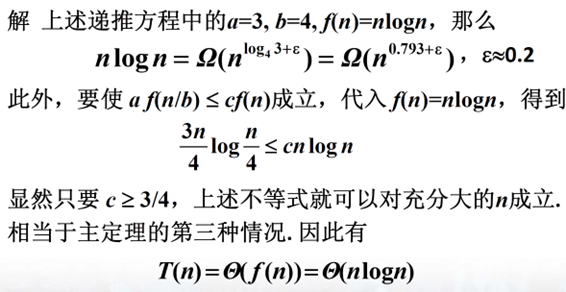
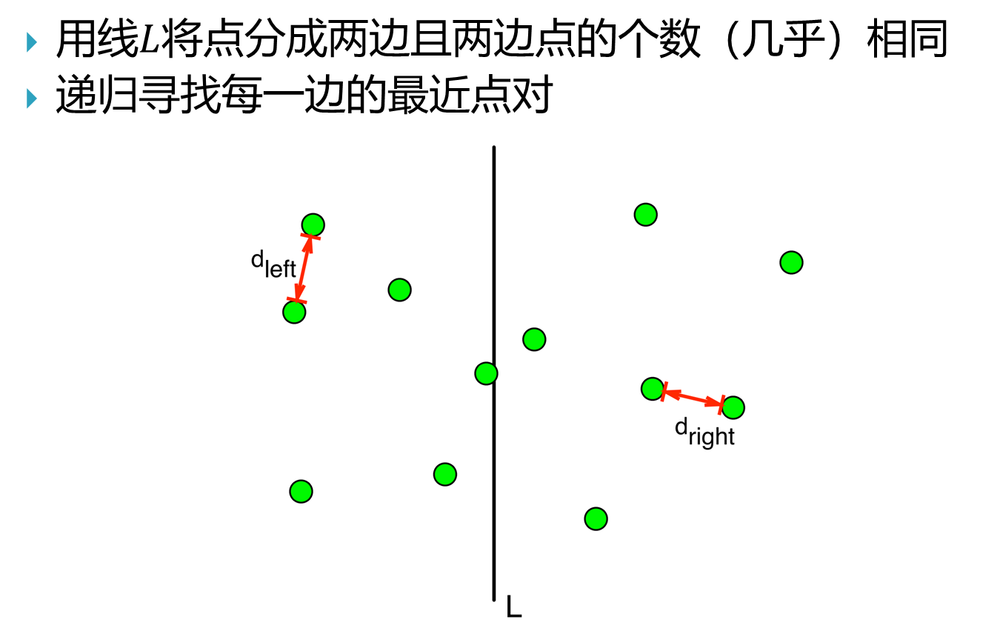
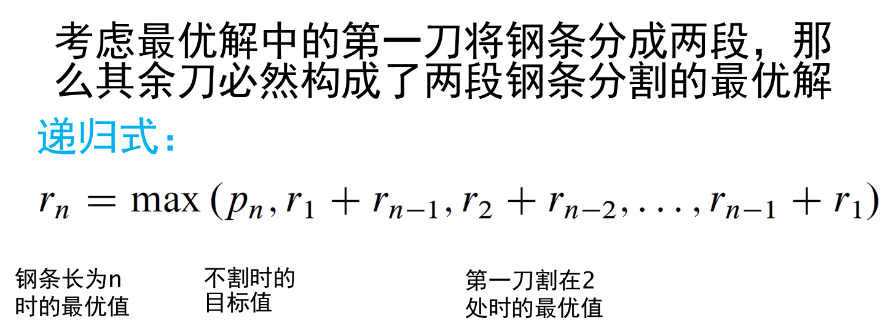
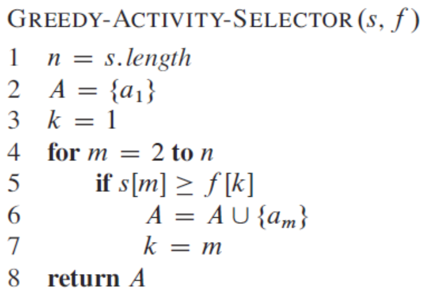

# 算法设计与分析知识点

## 第一讲

### 算法的定义

#### 算法的5个特征

有限指令的序列，指令序列确定了解决某种问题的运算或操作的步骤，却具有$5$个重要特征

**有穷性**：执行有限步骤内必须停止

**确切性**：每一步都必须是精确定义的

**输入**：有$0$个或多个输入，输入取自某个特定的的对象集合

**输出**：有$1$个或多个输出，输出同输入有着某种特定关系

**能行性**：每一步都是足够基本的，可以被精确地机械执行

<font color=red>若仅不满足有穷性，可称为计算方法</font>

### 欧几里得算法（辗转相除法）

```c++
输入:非负整数m,n,不全为0
输出:gcd(m,n)
while n > 0 do
    r <- m mod n
    m <- n
    n <- r
return m
```

#### 递归版本

```c++
输入:非负整数m,n,不全为0
输出:gcd(m,n)
Euclid(int m,n)
    if n=0
        then return m
        else return Euclid(n,m mod n)
```

### 如何评价算法

#### 正确性算法最基本的评价指标

<font color=red>正确性</font>：对每个合法输入，算法均会停止且输出正确的结果

不正确算法：在某个输入上不停止，或输出不正确的结果

### 如何评价算法运行效率

麻烦1：实际运行时间依赖机器硬件性能等外部因素

解决方案：<font color=red>基本运算次数</font>

麻烦2：算法在不同的问题实例上运行效率不同

解决方案：考虑输入规模，在固定的输入规模下，考虑以下情况下算法所需的基本运算次数

<font color=grenn>最坏情况：基本运算次数最多</font>

<font color=grenn>平均情况：考虑各种可能的输入下算法的平均性能</font>

### 时间复杂度：算法效率评价指标

时间复杂度：针对问题<font color=red>指定基本运算</font>，算法所做的基本运算次数

最坏情况下时间复杂度：算法求解输入规模为$n$的实例所需要的最长时间$W(n)$

平均情况下时间复杂度：在指定的输入概率分布下，算法求解输入规模为$n$的实例所需要的平均时间$A(n)$

### 算法的其它评价指标

空间复杂度：算法运行所需的存储空间（定义域时间）

## 第二讲

### 算法的时间复杂度

#### 时间的度量

针对问题指定基本运算，算法所做的基本运算次数

#### 问题输入规模，与如何输入有关

**排序**

关键码个数

**矩阵相乘**

矩阵的行列数$i,j,k$

**图的遍历**

图的顶点数，边数

#### 最坏情况下的时间复杂度

算法求解输入规模为$n$的实例所需的最多时间$W(n)$

#### 平均情况下的时间复杂度

在指定输入的概率分布下，算法求解输入规模为$n$的实例所需要的平均时间$A(n)$

### 渐近分析

一种描述函数在极限附近行为的东西

### 相对增长率

$\Omega (g)$：增长率不低于$g$的函数集合

$\Theta(g)$:增长率与$g$“相同”的函数集合

$O(g)$:增长率不高于$g$的函数集合

### 渐近界

设$f$和$g$是定义域为自然数$N$上的函数

（1）若存在正数$c$和$n_0$使得对于一切$n \ge n_0$有$0 \le f(n) \le cg(n)$成立，则称$f(n)$的渐进的上界是$g(n)$，记作
$$
f(n)=O(g(n))
$$
（2）若存在正数$c$和$n_0$，使得对一切$n \ge n_0$有$0 \le cg(n) \le f(n)$成立，则称$f(n)$的渐进的下界是$g(n)$，记作
$$
f(n)= \Omega(g(n))
$$
（3）若对任意正数$c$都存在$n_0$，使得当$n \ge n_0$时有$0 \le f(n) <cg(n)$成立，则记作
$$
f(n)=o(g(n))
$$
（4）若对于任意正数$c$都存在$n_0$，使得当$n \ge n_0$时有$0 \le cg(n) < f(n)$成立，则记作
$$
f(n)=\omega(g(n))
$$
（5）若$f(n)=O(g(n))$且$f(n)=\Omega(g(n))$，则记作
$$
f(n)=\Theta(g(n))
$$

### 素数测试

```c++
// 算法 PrimalityTest(n)
// 输入：n，n为大于2的奇整数
// 输出：true或者false
s <- \sqrt(n)
for j <- 2 to s
    if j 整除 n
        then return false
return true
```

**渐进符号做了哪些简化？**

<font color=grenn>抓关键因素：</font>

- <font color=grenn>仅考虑高阶项，忽略了低阶项</font>
- <font color=grenn>忽略高阶项的常系数</font>

### 渐进关系常采用极限来判断

<font color=red>定理1.1</font>设$f$和$g$是定义域为自然数集合的函数

（1）如果$\displaystyle \lim_{n \to \infty }{\frac{f(n)}{g(n)}}$存在且等于某个常数$c>0$，那么
$$
f(n)=\Theta(g(n))
$$
（2）如果$\displaystyle \lim_{n \to \infty }{\frac{f(n)}{g(n)}}=0$，那么
$$
f(n)=o(g(n))
$$
（3）如果$\displaystyle \lim_{n \to \infty }{\frac{f(n)}{g(n)}}=+\infty$，那么
$$
f(n)=\omega(g(n))
$$

### 基本性质

定理1.2 设$f,g,h$是定义域为自然数集合的函数

（1）如果$f=O(g)$且$g=O(h)$，那么$f=O(h)$

（2）如果$f=\Omega(g)$且$g=\Omega(h)$，那么$f=\Omega(h)$

（3）如果$f=\Theta(g)$和$g=\Theta(h)$，那么$f=\Theta(h)$

定理1.3 假设$f$和$g$是定义域为自然数集合的函数，若对某个其他的函数$h$，我们有$f=O(h)$和$g=O(h)$，那么
$$
f+g=O(h)
$$

### 基本函数类

#### 阶的高低

**至少指数级**

$2^n,3^n,n!,\cdots$

**多项式级**

$n,n^2,nlogn,n^{\frac{1}{2}},\cdots$

**对数多项式级**

$logn,logn^2n,\cdots$

### 一般性结论

**对数级函数增长率低于多项式函数**

​	对于任意常数$\alpha>0,lgn=o(n^\alpha)$

**多项式函数增长率低于指数级函数**

​	对于任意常数$\alpha>0,c>1,n^\alpha=o(c^n)$

### 阶层

#### Stirling公式

$$
n!=\sqrt{2\pi n}(\frac{n}{e})^n(1+\Theta(\frac{1}{n}))
$$

**阶乘**
$$
log(n!)=\displaystyle \sum_{k=1}^{n}\log k \le \int_{2}^{n+1} \log x\,dx = O(n \log n)
$$


### 基本求和公式

常用于对循环中各种迭代的运算次数求和
$$
\sum_{k=1}^{n}a_k=\frac{n(a_1+a_2)}{2}, \quad {a_k}为等差数列
$$

$$
\sum_{k=0}^{n}aq^k=\frac{a(1-q^{n+1})}{1-q},\quad \sum_{k=0}^{n}x^k=\frac{1-x^{n+1}}{1-x}
$$

$$
\sum_{k=1}^{n}aq^k=\frac{a}{1-q}\quad(q<1)
$$

$$
\sum_{k=0}^{n}\frac{1}{k}=\ln n+O(1)
$$

### 估计和式上界的方法付

#### 放大法

$$
\sum_{k=1}^{n}a_k\le na_{max}
$$

假设存在常数$r<1$，使得对一切$k \ge 0$有$\frac{a_{k+1}}{a_k}\le r$成立
$$
\sum_{k=0}^{n}a_k \le \sum_{k=0}^{\infty}r^k=\frac{a_0}{1-r}
$$
**积分法**

见阶乘部分

## 第三讲

### Hanoit塔

```c++
算法 Hanoi(A,B,C,n)
// 借助B柱将A柱n盘子移到C柱
if n==1 then move(A,C)
else Hanoi(A,C,B,n-1)
    move(A,C)
    Hanoi(B,A,C,n-1)
```


### 迭代归纳法的两个步骤

1.猜解

2.数学归纳证明，确定<font color=red>常数</font>

### 递归树

验证靠递归树“猜”的解

### 主定理

主定理：设$a\ge1 ,b > 1$为常数，$f(n)$为函数，$T(n)$为非负整数，且
$$
T(n)=aT(\frac{n}{b})+f(n)
$$
则有以下结果：

1.若$f(n)=O(n^{\log_{b}a-\varepsilon}),\varepsilon>0$，那么$T(n)=\Theta(n^{\log_{b}a})$

2.若$f(n)=n^{\log_{b}a}$，那么$T(n)=n^{\log_{b}a}\log n$

3.若$f(n)=\Omega(n^{\log_b{a+\varepsilon}}),\varepsilon>0$，且对于某个常数$c<1$和充分大的$n$有$af(\frac{n}{b})\le cf(n)$，那么$T(n)=\Theta(f(n))$

#### 主定理应用示例




#### 主定理的条件之间有空隙


## 第四讲

### 回归递归法

求解带参数$n$的问题时，可以考虑如何从参数小于$n$的同类问题（子问题）的解获得原问题的解

#### 主要任务

如何从子问题的解获取到原问题的解

### 归并排序


### 分治算法的一般性描述


### 分治算法的代价

#### 算法时间复杂度的递推方程

$$
\begin{cases}
W(n) = W(|P_1|) + W(|P_2|) + \dots + W(|P_k|) + f(n) \\
W(c) = C
\end{cases}
$$

一般采用<font color=red>均匀划分</font>，时间复杂度也相对较低

### 幂乘计算

**问题**：设$a$为给定实数，计算$a^n$，$n$为自然数
$$
\begin{cases}
a^{\frac{n}{2}}\times a^{\frac{n}{2}}&n为偶数 \\
a^{\frac{(n-1)}{2}}\times a^{\frac{(n-1)}{2}}\times a&n为奇数
\end{cases}
$$


### Fibonacci数的计算


**时间复杂度**：$\Theta (n)$


**时间复杂度**：$\Theta(\log n)$

### 最大子数组问题

给定一个数组$A[0\cdots n-1]$，找子数组$A[i\cdots j]$，使其元素和最大

#### 暴力求解


#### 分治法


**用于找到包含指定中点的跨越式最大子数组**


**用于找到整个数组范围内的最大子数组**


**时间复杂度**$O(n \log n)$

## 第五讲

### 回顾分治算法


### 整数乘法

#### 分治


##### 递推式和时间复杂度


### 改进（Karatsuba）


### 矩阵乘法


#### 分治


##### 递推式和时间复杂度


**时间复杂度为**$O(n^3)$

#### Strassen算法


##### 递推式和时间复杂度


### 平面最近点对问题


#### 分治




#### 几何性质


#### 分治算法1


##### 分析


##### 改进思路


#### 分治算法2


##### 分析


## 第六讲

### 钢条切割问题


#### 最优子结构



#### 简单的递归式


#### 递归的解法


##### 调用次数


#### 动态规划算法：自底向上法实现


#### 动态规划算法：带备忘录的自顶向下法实现


完全消除递归是因为“前面”每个子问题的解均能“查”到。

#### 最优值和最优解

最优值还不是解，我们需要得到实现最优值的“那个解”

#### 递归算法（自顶向下递归）vs动态规划算法

核心都是最优子结构

递归算法：时间复杂度高，空间消耗较小

动态规划算法：时间复杂度较低，空间消耗多

动态规划提高效率的原因：<font color=red>用空间换时间</font>

### 矩阵连乘问题


#### 矩阵乘法的代价


#### 解空间


#### 最优值的递归表示


#### 动态规划算法


## 第七讲

### 动态规划解题基本步骤

**刻画最优子结构**

**递归定义最优值**

**计算最优值，通常采用自底向上的方法**

**利用计算出的信息构造一个最优解**

### 最优子结构的定义


### 发现最优子结构的常用模式


### 动态规划的基本步骤


### 最长公共子序列（LCS）


#### 刻画最优子结构


#### 递归定义最优值


#### 构造最优解


### 0-1 背包问题


#### 刻画最优子结构


#### 子问题划分、递归定义最优值


### 最大子数组问题


#### 动态规划求解


## 第八讲

### 活动选择问题


#### 容易想到的一些策略


#### 递归式


#### 动态规划解法


#### 贪心法


#### 上述思路的合理性


#### 证明


#### 用递归方法计算（子）问题$S_k$


#### 迭代式求解



#### 算法设计过程


#### 贪心策略一般步骤


#### 贪心算法的两个关键要素


## 第九讲

贪心下

回顾贪心策略的一般步骤

Huffman算法

最小生成树：

Prim算法

Kruskal算法

## 第十讲

## 第十一讲

## 第十二讲

## 第十三讲

# 样卷

## 简答题

### 简述算法的$5$个重要特征

有限性、确定性、输入、输出、可行性

### 简述分支界限法中剪枝的依据

#### 1.约束函数剪枝依据

根据问题的约束条件，状态空间中部分状态，可能是不合法的，以不合法状态为根的分支不含可行解，可以剪枝

#### 2.限界函数剪枝依据

限界函数评估了当前搜索状态或分支可能达到目标函数的范围，若某个分支已经确定不会优于当前已知最优解，则可以进行剪枝

### 简述最优子结构性质

一个问题的最优解包含了其子问题的最优解

### 什么是NPC？若证明了某问题为NPC，谈谈对该问题求解有何意义？

NPC问题是NP问题中的一个子集，是NP中最难的问题

1.该问题是NP问题，即存在一个非确定性多项式算法可验证该问题的解

2.所有NP问题都可以多项式时间规约到该问题

### 已知递推公式$T(n)=2T(n/2)+n-1$，其中$n=2^k,T(1)=0$,求$T(n)$

$T(2^k)=2T(2^{k-1})+2^k-1$

​	$=2(2T(2^{k-2})+2^{k-1}-1)+2^k-1$

​	$=2(2(2T(2^{k-3})+2^{k-2}-1)+2^{k-1}-1)+2^k-1$

​	$\cdots$

​	$=2^kT(2^0)+k \cdot 2^k - (2^k-1)$

​	$=k \cdot 2^k -2^k -1$

​	$=nlogn-n+1$

### 某递归算法的时间复杂度的递推公式是$T(n)=T(n/3)+T(2n/3)+n,T(1)=O(1)$，用递归树推导出$T(n)$的渐进上界表达式


设递归树层数$k$,$n \cdot (\frac{2}{3})^2=1\quad k=O(logn)$(用换底公式提出$\frac{2}{3}$)

$T(n)=O(nlogn)$

## 算法设计与分析题

给定整数数组$A[1 \cdots n],n \ge 2$，要求计算最大差，定义如下：
$$
d=\max_{1 \le i \le j \le n} A(j) - A(i)
$$

### 设计一个分治算法，并给出时间复杂度

将$A[1 \cdots n]$分解为两个子数组$A[left,mid]$和$A[mid+1,right]$递归地在这两个子数组上计算最大差值，即计算$A[left,mid]$中最小值与$A[mid+1,right]$最大值之差，取两者中的较大值作为跨越中的最大差值

将两个子数组最大差值与跨越中点最大差值比较，取三者最大值作为整个数组最大差值，时间复杂度为$O(nlogn)$

```c++
function maxDifference(A left,right):
	if left == right;
		return 0;	// 数组中只有一个元素，最大差值为0
	mid = (left +right)/2
    // 递归地在两个子数组上计算最大差值
    leftMaxDiff = maxDifference(A,left,mid)
    rightMaxDiff = maxDifference(A,mid+1,right)
    // 计算跨越中点的最大差值
    leftMax = max(A[left,mid])
    leftMin = min(A[left,mid])
    rightMax = max(A[mid+1,right])
    rightMin = min(A[mid+1,right])
    
    crossMaxDiff = max(leftMax - rightMin,leftMin - rightMax)
    // 返回整个数组的最大差值
    return max(leftMaxDiff,rightMaxDiff,crossMaxDiff)

result = maxDifference(A,1,n)
```

### 已知有$n$种硬币，币值分别为$1,a,a^2,\cdots,a^{n-1}$,其中$a \ge 2$为整数。设计一种高效算法，使得对于任意正整数$M$，能够找出数目最少且硬币币值和恰好为$M$。要求说明算法的主要思想，证明其正确性，并给出其时间复杂度。

使用动态规划算法

使用一维数组$dp$，其中$dp[i]$表示凑成金额$i$所需的最少硬币数。

初始化$dp[0]=0$，表示凑成金额$0$不需要任何硬币

对于其他金额$i$，初始化$dp[i]= \infin$（可用一个足够大的数替代）

从$i=1$到$M$，遍历所有可能的金额

对于每个金额$i$，遍历所有硬币面值$j(1,a,a^2,\cdots,a^{n-1})$若$i-coin[j]\ge0$且$dp[i-coin[j]]+1<dp[i]$。则更新$dp[i]=dp[i-coin[j]]+1$

最终，$dp[M]$即为凑成金额$M$所需最少硬币数

**证明**：初始化步骤证明了$dp[0]=0$是正确的

状态转移方程$dp[i]=\min(dp[i-coin[j]+1])$（对于所有$coin[j]\le i$）保证了每次选择当前能用的最大面值硬币，以使得所用硬币数最少，遍历所有金额和面值确保算法考虑了所有可能的组合

时间复杂度$O(M \times n)$

```c++
function minCoins(M,a,n)
    dp = array of size M+1 initialized to \infin
    dp[0] = 0
    coins = [1,a,a^2,\cdots,a^{n+1}]
    for i from 1 to M:
		for j from 0 to n-1:
			if i- coins[j] >= 0 && dp[i-coins[j]]+1 < dp[i]
    return dp[M] if dp[M] != \infin else-1	// -1表示not found
```

