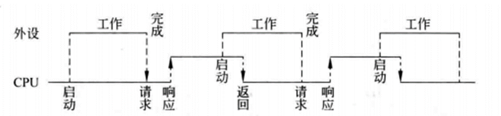

# 计算机组成原理必备知识点

## 前言

本文档由本人复习计算机组成原理期末考试所总结，所有习题以及知识点的页数参考2025年王道计算机组成原理

# 计算机系统概论

## 将高级语言源程序转换成可执行目标文件的主要过程

预处理->编译->汇编->链接

## 计算机的性能指标

### 机器字长

计算机中处理器一次能够处理的二进制数据的位数

### 存储字长

计算机中主存储器（RAM）或其他存储器设备每个存储单元（例如内存单元或存储单元）可以容纳的二进制数据位数

### 指令字长

计算机中指令的二进制表示的位数。

## 一些需要注意的知识点

### 时钟周期

一次脉冲的时间，计算机中最基本最小的时间单位

### MIPS

每秒钟可以执行多少百万条指令

## 位数（宽度）与机器字长相同的部件

ALU（算术逻辑单元） 通用寄存器

### 时间换算

1s=1000ms  1ms=1000$\mu \text{s}$

## 冯诺依曼机器中指令和数据均以二进制的形式存放在存储器中，请解释CPU是如何区分指令与数据的？

通常完成一条指令可分为取指阶段和执行阶段。在取指阶段通过访问存储器可将指令取出；在执行阶段通过访问存储器可将数据取出。这样，虽然指令和数据都以二进制代码形式存放在存储器中，但CPU可以判断在取指阶段访问存储器取出的二进制代码是指令，在执行阶段取出的二进制代码是数据。

指令操作码的译码结果，得到的是本条指令要执行什么操作，如加法、减法等。指令和数据的寻址方式不足以区分取出的内容是指令还是数据的。指令和数据都是以二进制的形式存储在主存单元中的，因此，根据指令和数据所在的存储单元是不能进行区分的。

## 请简述指令周期、机器周期、时钟周期的区别

指令周期是CPU处理一条指令花费的时间。有些资料把CPU工作使用的时钟信号叫做机器周期。有些资料把CPU工作使用的时钟信号的周期叫做CPU时钟周期。

CPU工作时需要外界提供连续的周期信号。该信号就是时钟周期。有些CPU直接使用该信号，把该信号叫做机器信号。这种情况，机器信号与时间信号是一样的。

# 运算方法和运算器

## n+1位补码所能表示的范围

$-2^{n}$ —— $2^{n}-1$

最小的数，如$-2^{n}$由原码中的负0来表示

## n+1位原码所能表示的范围

$-(2^{n}-1)$—— $2^{n}-1$

## 各种类型的数的长度

### int

4B 32位

### char 

1B 8位

### short

2B 16位

### float

4B 32位

## 右移

### 逻辑右移

对于无符号数而言的，高位补0即可

### 算数右移

对于有符号数而言的，高位补符号位

### 计算机以及C语言中

数字都是用补码进行表示的

## 带标志的加法器

CF是无符号数溢出标志，OF是有符号数溢出标志

### 溢出标志的逻辑表达式

$OF$=$C_n$$\oplus$$C_{n-1}$​

其中$C_n$表示第n位的进位

### 进位/借位标志

$CF$=$C_{out}$$\oplus$$C_{in}$

$C_{in}$等价于Sub的选择控制，为1时表示做减法
加法时,CF为1表示有进位；减法时，CF取反为1表示有借位

### 最简单的判断方法

人为相加

判定CF时，把两者当成无符号数，看是否进位
判定OF时，把两者当成有符号数，看是否进位或借位

### 标志位

进位/借位标志CF是无符号数的溢出概念

符号标志SF，溢出标志OF是有符号数的溢出，都是有符合数的概念

零标志ZF既可以用在有符合数，又可以用在无符号数

## 透明性

在CPU中，IR、MAR和MDR对各类程序员都是透明的

## IEEE 754

### 单精度浮点数

1位符号位 8位阶码 23位尾数

阶码的移码是127

尾数在小数点前隐含了1

### 双精度浮点数

1位符号位 11位阶码 52位尾数

阶码的移码是1023

尾数在小数点前隐含了1

### float类型（即IEEE 754单精度浮点数格式）能表示的最大正整数是

$2^{128}-2^{104}$

$(2-2^{-23})\times2^{127}$

### IEEE 754单精度浮点式表示的数中，最小的规格化正数是

$1.0\times2^{-126}$

阶码的范围(-126——127)

## 用移码表示浮点数的阶码有什么好处？

### 移码的两个好处：

1）浮点数进行加减运算时，需要比较阶码的大小，移码比较大小更方便。

2）检验移码的特殊值(0和max)时比较容易。阶码以移码编码时的特殊值如下。

**0**:表示指数为负无穷大，相当于分数分母无穷大，整个数无穷接近0，在尾数也为0时可用来表示0;尾数不为零表示未规格化的数。

**max**:表示指数正无穷大，若尾数为0，则表示浮点数超出表示范围(正负无穷大);尾数不为0，则表示浮点数运算错误。

## 规格化

一言以蔽之就是即符号位和有效位最高位必须不同。

如果是原码则符号位为0，则最高位必须为1

如果是补码则符号位为1，则最高位必须为0

# 存储系统

## 区分一下大端存储和小端存储

### 大端存储

低字节放在高地址，高字节放在低地址（正常人眼可以看的那种）

### 小端存储

高字节放在高地址，低字节放在低地址（便于机器进行运算）

## 关于RAM和ROM的叙述

1）RAM是易失性存储器（Random access memory），ROM是非易失性存储（Read only memory）

2）RAM和ROM都采用随机存取方式进行信息访问

3）SRAM可用作Cache

4）DRAM需要进行刷新

### DRAM地址线复用

DRAM芯片容量较大，地址线位数较多，为了减少芯片的地址引脚数，通常采用地址引脚复用技术，行地址和列地址通过相同的引脚分先后两次输入，这样地址引脚可减少一半。

## MAR和MDR位数与地址线/数据线数的关系

MDR的位数与数据线的位数相同，MAR的位数与地址线的位数相同。

### 注意

数据线的位数通常等于存储字长，因此MDR的位数通常等于存储字长；若数据线的位数不等于存储字长，则MDR的位数由数据线的位数决定。

## 主存储容量扩展

### 例题

假定用若干2K$\times$4位的芯片组成一个8K$\times$8位的存储器，则地址0B1FH所在芯片的最小地址是？

### 解答：

高位先片选，先选出是哪一块片，再进行片内地址选择，先将0B1FH化成二进制0000 1011 0001 1111，由2K是$2^{11}$​所以片内地址位数是11位，由于需要4个片，则片选信号的位数为2位。

所以011 0001 1111是片内地址，01是片选信号，则此芯片最小地址为片内地址为0，则0000 1000 0000 0000即0800H

## Cache每行中有的东西

Cache每行除了默认有数据（Data）、Tag和有效位之外，如果强调了采用LRU替换算法和回写策略，则分别对应了LRU位和脏位

### Cache中有效位的作用

Cache中有效位用来指出所在Cache行中的信息是否有效

## Cache与主存 主存与辅存

Cache-主存层主要解决 **CPU和主存速度不匹配**的问题，主存和 Cache 之间的数据调动是由硬件自动完成的，对所有程序员均是**透明**的。主存一辅存层主要解决**存储系统的容量**问题，主存和辅存之间的数据调动是由硬件和操作系统共同完成的，对应用程序员是透明的。

## Cache总容量和Cache数据区的容量的区别

### Cache总容量

Cache总容量是要加上Tag+有效位 然后再看要不要LRU算法（就是看要不要算上LRU位呢）以及判断是不是用回写法然后判断要不要一位脏位

| 1位    | 1位  | log_2（组内块数） | Tag    |             |
| ------ | ---- | ----------------- | ------ | ----------- |
| 有效位 | 脏位 | LRU位             | 标记位 | Cache块数据 |

<center><strong>一行Cache的容量</strong></center>

其中的组内块数是指看是几路组相联，例如2路组相联，则LRu位是1位，4路组相联则为2位。

## Cache和主存的映射方式

### 比较器的位数

比较器的位数和Tag的位数相等，然后个数和是m路组相联相等的m相等

### 1）直接映射

| 标记位 | Cache行号 | 块内地址 |
| ------ | --------- | -------- |

可以理解为1路组相联映射，则比较器数为1，比较器的个数和组内Cache行数相等（即判断是几路组相联），而比较器的位数和Tag位相等。

### 2）全相连映射

| 标记位 | 块内地址 |
| ------ | -------- |

全相连映射假设有m行，则可以看成是m路组相联（即有几行就有几个比较器），然后比较器位数和Tag位数相等。

### 3）组相连映射

| 标记位 | 组号 | 块内地址 |
| ------ | ---- | -------- |

几路组相联，比较器个数就是几，然后比较器位数和Tag位数相等。

## 王道计组Cache映射方式习题

**P121 例3.4（重难点）**

### 例题2

某计算机的 Cache共有16块，采用二路组相联映射方式(即每组2块)。每个主存块大小为 32B，按字节编址。主存129号单元所在主存块应装入到的Cache组号是。

### 解答

| Tag  | 组号 3位 | 块内地址 5位 |
| ---- | -------- | ------------ |

<center>二路组相联的地址结构</center>

由每个主存块大小为32B且按字节编址，则快内地址为5位，由采用二路组相联，且Cache共16块，则组号有8个，则位数是3位，则129转换二进制是1000 0001，前3位是组号，后5位表示块内地址，则组号为100，转换成二进制是4

### 例题3

有如下C语言程序段:
for(k=0; k<1000; k++)

​	a[k]=a[k]+32;

​	若数组a及变量k均为int型，int 型数据占 4B，数据 Cache 采用直接映射方式，数据区大小为1KB、块大小为16B，该程序段执行前 Cache为空，则该程序段执行过程中访问数组a的Cache 缺失率约为?

### 解答

块大小是16B而数组a是int型，则一块可以装4个连续的数据，如a[0],a[1],a[2],a[3]，则例如先读入a[0]发现缺失，则将对应的主存块调入到Cache中，有a[0],a[1],a[2],a[3]，则将a[0]+32赋值给a[0]时没有缺失，同理后面的a[1],a[2],a[3]的读取和赋值操作都不会发生缺少，当需要读取a[4]时则发生缺少，再将对应的主存块调入，所以每8次操作中有1次缺失，则Cache的缺失率为12.5%

### 例题4

若计算机主存地址为32位，按字节编址，Cache数据区大小为32KB，主存块大小为32B采用直接映射方式和回写(WriteBack)策略，则Cache行的位数至少是？

### 解答

| Tag 17 | 组号 10 | 块内地址 5 |
| ------ | ------- | ---------- |

<center>直接映射的地址结构</center>

由主存块大小为32B，且按字节编址，则块内地址是5位，由Cache数据区大小为32KB，主存块大小为32B，则有1K个组，即组号为10位，则Tag为17位，由Cache行等于（Tag+data+“有效位”+“脏位”,期中data位表示数据）则位数=(17+32$\times$​8+1+1)=275

### 例题5

若计算机主存地址为32位，按字节编址，某Cache的数据区容量为 32KB，主存块大小为 64B，采用8路组相联映射方式，该Cache中比较器的个数和位数分别为

### 解答

| Tag 20 | 组号 6 | 块内地址 6 |
| ------ | ------ | ---------- |

<center>组相联映射的地址结构</center>

由主存块大小为64B且按照字节编址，则块内地址为6位，由Cache的数据区容量为 32KB，主存块大小为 64B，则Cache行共有512行，又是8路组相联，则共64组，则组号为64，则组号为6位，则Tag为20位，由比较器的个数和组内Cache行数相等，则比较器个数为8，而比较器的位数和Tag位比较，则位数为20

### 指令Cache与数据Cache分离的主要目的是减少指令流水线资源冲突

5个过程

**IF**（Instruction Fetch，取指令）

**ID**（Instruction Decode，指令译码

**EX**（Execute，执行）

**M**（Memory Access，访存）

**WB**（Write Back，写回）

这5个过程组成了指令流水线。

## 虚拟存储器

用户编程允许涉及的地址称为**虚地址**或**逻辑地址**，虚地址对应的存储空间称为虚拟空间或程序空间。实际的主存单元地址称为**实地址**或**物理地址**，实地址对应的是主存地址空间，也称实地址空间。虚地址比实地址要大很多。

## 缺页

只有指令访存的时才会出现缺页的情况，出现缺页需要到磁盘中调入

## TLB采用静态存储器（SRAM）

TLB采用静态存储器（SRAM），读/写速度快，但成本高，多用于容量较小的高速缓冲存储器

## 虚拟存储器与Cache的比较

### 1.相同之处

1)最终目标都是为了提高系统性能，两者都有容量、速度、价格的梯度。
2)都把数据划分为小信息块，并作为基本的交换单位，虚存系统的信息块更大。
3)都有地址映射、替换算法、更新策略等问题。
4)都依据局部性原理应用“快速缓存”的思想，将活跃的数据放在相对高速的部件中。

### 2.不同之处

1)Cache 主要解决系统速度，而虚拟存储器却是为了解决主存容量(解决的问题不同)。
2)Cache 全由硬件实现，是硬件存储器，对所有程序员透明;而虚拟存储器由操作系统（OS）和硬件共同实现，是逻辑上的存储器，对系统程序员**不透明**，但对应用程序员**透明**。

3)对于不命中性能影响，因为CPU的速度约为Cache的10倍，主存的速度为硬盘的100倍以上，因此虚拟存储器系统不命中时对系统性能影响更大。

4)CPU与Cache 和主存都建立了直接访问的通路，而辅存与 CPU 没有直接通路。也就是说在Cache 不命中时主存能和 CPU 直接通信，同时将数据调入Cache;而虚拟存储器系统不命中时，只能先由硬盘调入主存，而不能直接和CPU通信。

## 地址转换

在虚拟存储系统中，指令给出的地址是**虚地址**，因此当CPU执行地址转换为主存物理地址，才能到主存中取存指令和数据。

### 虚拟地址转换

| 虚页号 20 | 页内地址 12 |
| --------- | ----------- |

<center>虚拟地址格式</center>

假设我们的虚拟地址空间大小为4GB，且按照字节编址，字长为32位，假设页面大小为4KB，则页内地址的位数为12位，则虚页号为20位，然后我们就可以将虚拟地址按照二进制展开，然后选择前20位作为虚页号，对照快表TLB，求出对应的实页号。

## 缺页处理的叙述

1）缺页是在地址转换时CPU检测到的一种异常

2）缺页处理由操作系统提供的缺页处理程序来完成

3）缺页处理程序根据页故障从外存读入所缺失的页

4）缺页处理完成后回到发生缺页的指令执行

## 王道计组Cache和页表大题

P129 05[2010统考真题]

P129 07[2020统考真题]

P146 04[2011统考真题]

P146 05[2016统考真题]

P147 06[2018统考真题]

P147 07[2021统考真题]

## 为什么Cache可以采用直写策略，而修改页面内容时总是要采用回写策略？

因为采用直写策略时需要同时写快速存储器和慢速存储器，而写磁盘比写主存慢很多，所以在Cache-主存层次，Cache可以采用直写策略，而在主存-外存（磁盘）层次，修改页面内容时总是采用回写策略。

## 程序计数器（PC）

1）直接通过硬件实现PC+"1"

2）把PC值和常数“1”作为ALU的输入 然后加法操作 得出结果

## 汇编程序员可见的寄存器

重逻辑 非物理

### 用户可见寄存器

通用寄存器组（GPRs,含基址/变址）、程序状态字寄存器(PSW)、程序计数器(PC)、累加寄存器（ACC）、移位寄存器。

### 用户不可见

存储器地址寄存器（MAR）、存储器数据寄存器（MDR）、指令寄存器（IR）、暂存寄存器。

### 注意

中断周期中的进栈操作是将 SP减“1”，这和传统意义上的进栈操作相反，原因是计算机中的堆栈都是向低地址方向增长，所以进栈操作是减“1”而不是加“1”。

# 指令系统

## 变址寻址和基址寻址的适用场景

### 变址寻址

变址寻址主要用于**处理数组问题**，适合编制循环程序

### 基址寻址

基址寻址扩大了操作数寻址范围,适用于多道程序设计,常用于为**程序或数据分配存储空间**

## 寻址方式、有效地址及访存次数

| 寻址方式       | 有效地址    | 访存次数 |
| -------------- | ----------- | -------- |
| 立即寻址       | A即是操作数 | 0        |
| 直接寻址       | EA=A        | 1        |
| 一次间接寻址   | EA=（A）    | 2        |
| 寄存器寻址     | EA=R_i      | 0        |
| 寄存器间接寻址 | EA=(R_i)    | 1        |
| 相对寻址       | EA=(PC)+A   | 1        |
| 基址寻址       | EA=（BR）+A | 1        |
| 变址寻址       | EA=(IX)+A   | 1        |

## 寻址范围

直接寻址的寻址只能寻找到正数，即范围内的都是正数

间接寻址 相对寻址 立即寻址 则可能为负，因为间接寻址和相对寻址都是寻找一个偏移量而立即寻址是直接给出立即数，可以为负。

## 一般来说，指令分为哪些部分？每部分有什么用处？

一条指令通常包括**操作码字段**和**地址码字段**两部分。其中，**操作码**指出指令中该指令应该执行什么性质的操作和具有何种功能，它是识别指令、了解指令功能与区分操作数地址内容的组成和用方法等的关键信息。**地址码**用于给出被操作的信息(指令或数据)的地址，包括参加运算的一或多个操作数所在的地址、运算结果的保存地址、程序的转移地址、被调用子程序的入口地址等

## 单字长指令格式

| OP（操作数） | MS（寻址方式） | RS（源寄存器） | Md（寻址方式） | Rd（目的寄存器） |
| ------------ | -------------- | -------------- | -------------- | ---------------- |

## 王道计组指令系统大题

P174 07 [2013统考真题]

P176 09 [2021统考真题]

# 中央处理器

## 请简单列出影响CPU流水线的因素，并针对每一种因素的不同类型给出解决方法。

### 1）资源冲突（结构冒险）

1.前一条指令访存时，使后一条相关指令（及其后续指令）暂停一个时钟周期；

2.单独设置数据存储器和指令存储器

### 2）数据冲突（数据冒险）

1.把数据相关指令及其后续指令都暂停一至几个时钟周期，直到数据相关问题消失后再继续执行，可分为硬件阻塞（stall）和软件插入NOP指令两种方法

2.设置相关专用通路，即不等前一条指令把计算结果写回寄存器。下一条指令也不再读寄存器，而直接把前一条指令的ALU计算结果作为自己的输入数据开始计算过程，即数据旁路技术。

3.通过编译器对数据相关的指令编译优化的方法，调整指令执行顺序来解决数据相关问题。

### 3）控制冲突（控制冒险）

1.对转移指令进行分支预测，尽早生成转移目标地址。

2.预取转移成功和不成功两个控制流方向上的目标指令。

3.加快和提前形成条件码。

4.提高转移方向的猜准率。

## ALU中设置暂存器的原因

在单总线数据通路中，每一时刻总线上只有一个数据有效。由于 ALU是一个没有存储功能的组合逻辑元件，在其执行运算时必须保持两个输入端同时有效，因此先将一个操作数经内部总线送入暂存器Y保存;Y的内容在ALU的左输入端始终有效，再将另一个操作数经内部总线直接送到 ALU的右输入端。此外，ALU的输出端也不能直接与总线相连，否则其输出会通过总线反馈到输入端，影响运算结果，因此将运算结果暂存在暂存器中。

## 为什么ALU后面设置暂存器的原因

ALU的输出端产生运算结果，但由于总线正被占用，因此需要暂存器Z，以缓解ALU输出端的数据

## 控制器的功能和工作原理

王道P234

## 微程序控制器习题

### 相对于微程序控制器，硬布线控制器的特点

指令执行速度快，指令功能的修改和扩展难

### 例题1

某计算机的控制器采用微程序控制方式，微指令中操作控制字段采用字段直接编码法，共有33个微命令，构成5个互斥类，分别包含7、3、12、5和6个微命令，则操作控制字段只是有？

### 解答

由于采用字段直接编码法，且全0不能使用，则5个互斥类分别需要8,4,12,5,6个微命令（要在已有的微命令的基础上加一，因为全0不能用），则分别要3,2,4,3,3位，一共15位。

### 主存储器（MM）和控制存储器（CS）的叙述

1）MM在CPU外，CS在CPU内

2）MM按照地址访问，CS也按照地址访问

3）MM存储指令和数据，CS存储微指令

4）MM用RAM和ROM实现，CS用ROM实现

### 处理器在一个时钟脉冲信号执行一条新指令的情况

1）CPI=1

2）指令流水线技术跑开

所以处理器总是在每来一个时钟脉冲信号时就开始执行一条新的指令是错的。

## 王道计组数据通路大题

P224 03 [虽然不是真题，但是老师试卷上考过]

P225 07（2009统考真题）

P226 08 （2015统考真题）

P227 09 (2022统考真题)

## 数据通路的操作举例

王道P220

## 指令流水线

### 1.超标量技术

每个周期内可并发多条独立指令

配置多个功能部件

不能调整指令的执行顺序

通过编译优化技术，把可并行执行的指令搭配起来。


#### 关于超标量流水线特性的叙述

1）能在一个时钟周期内同时发射多条指令

2）能结合动态调度技术提高指令执行并行性

### 2.超流水线技术

在一个时钟周期内**再分段**

在一个时钟周期内一个功能部件使用多次

不能调整指令的执行顺序

靠编译程序解决优化问题


## 理想情况下，CPI为1的处理器

1）单周期CPU

2）基本流水线CPU

## 王道计组指令流水线大题

P263 03 [2012统考真题]

P264 04 [2014统考真题]

P265 05 [2014统考真题]

## 指令流程和控制信号例题

### 例子

分析指令ADD (R0),R1[即实现（(R0)）+(R1)->(R0)]的指令流程和控制信号

### 解答

#### 1）取指周期：公共操作。

| 时序 | 微操作           | 有效控制信号       | 具体功能                                   |
| ---- | ---------------- | ------------------ | ------------------------------------------ |
| 1    | (PC)->MAR        | PCout,MARin        | 将PC经内部总线送至MAR                      |
| 2    | M(MAR)->MDR,Read | MemR,MARout,MDRinE | 主存通过数据总线将MAR所指单元的内容送至MDR |
| 3    | (MDR)->IR        | MDRout,IRin        | 将MDR的内容送至IR                          |
| 4    | 指令译码         | 无                 | 操作字开始控制CU                           |
| 5    | (PC)+1->PC       | 无                 | 当PC+1有效时，使PC内容加1                  |

#### 2）取数周期：完成取数操作，被加数存在主存中，加数已经放在寄存器R1中。

| 时序 | 微操作      | 有效控制信号       | 具体功能                                                 |
| ---- | ----------- | ------------------ | -------------------------------------------------------- |
| 1    | (R0)->MAR   | R0out,MARin        | 将R0中的地址（形式地址）送至存储器地址i寄存器            |
| 2    | M(MAR)->MDR | MenR,MARout,MDRinE | 主存通过数据总线将MAR所指单元的内容（有效地址）送至MDR中 |
| 3    | (MDR)->Y    | MDRout,Yin         | 将MDR中数据通过数据总线送至Y                             |

#### 3）执行周期：完成加法运算，并将结果返回主存。

| 时序 | 微操作        | 有效控制信号                     | 具体功能                               |
| ---- | ------------- | -------------------------------- | -------------------------------------- |
| 1    | (R1)+(Y)->Z   | R1out,ALUin,CU向ALU发ADD控制信号 | R1的内容和Y的内容相加，结果送至寄存器Z |
| 2    | (Z)->MDR      | Zout,MDRin                       | 将运算结果送至MDR                      |
| 3    | (MDR)->M(MAR) | MemW,MDRoutE,MARout              | 向主存写入数据                         |

# 总线系统

## 请简述总线链式判优控制方式的优缺点。

总线链式判优控制方式结构简单，但是优先级固定。链中在前面的设备的使用总线的优先级高，后面的设备使用总线的优先级变低。

## 总线

总线定时是指总线在双方交换数据的过程中需要时间上的配合关系的控制，这种控制称为总线定时，其实质是一种协议或规则，主要有**同步**和**异步**两种基本的定时方式。

### 1）申请分配阶段

由于需要使用总线的主模块（或主设备）提出申请，经总线仲裁机构决定将下一传送周期的总线使用权授予某一申请者。也可以将此阶段细分为<span style="color: red;">**传输请求和总线仲裁**</span>两个阶段。

### 2）寻址阶段

取得使用权的主模块通过总线发出本次要访问的从模块（或从设备）的地址及有关命令，启动参与本次传输的从模块。

### 3）传输阶段

主模块和从模块进行数据交换，可单向或双向进行数据传送。

### 4）结束阶段

主模块的有关信息均从系统总线上撤除，让出总线使用权。

### 注意事项

<span style="color: red;">**不互锁方式速度最快、可靠性最差**。</span>因为不能保证对方是否接收到自己发出的信号

<span style="color: red;">**全互锁方式速度最慢、最可靠。**</span>因为主设备只有获得回答信号之后，才会撤销自己的请求;从设备只有检测到主设备撤销了请求信号之后，才会撤销自己的回答信号。

## 不互锁方式 半互锁方式 全互锁方式的共同点

一个总线传输周期（以输入数据为例）

1）主模块发地址、命令             <span style="color:  #40E0D0;">**使用总线**</span>

2）从模块准备数据           <span style="color: #40E0D0;">**不使用总线**</span>

3）从模块向主模块发数据           <span style="color: #40E0D0;">**使用总线**</span>

## 提高同步总线数据传输率的方法

1）增加总线宽度

2）提高总线工作频率

3）支持突发传输

# 输入/输出系统

## 输入输出系统

### I/O接口的通用结构

#### 状态寄存器和控制寄存器的关系

**传送方向**

从功能上来说，状态寄存器主要用于接受来自<font color=red>外设或接口</font>的**状态信息**，并将其传递给CPU；而控制寄存器则用于接受<font color=red>来自CPU</font>的**控制指令**,并将其传递给外设或接口。因此，在数据传送方向上。状态寄存器和控制寄存器是相反的。

**访问时间**

由于CPU需要交替地读取状态信息和写入状态信息，因此它对状态寄存器和控制寄存器的访问时间是错开的。这种错开访问机制有助于确保数据传输的顺畅和系统的稳定性。

**合并设计**

在一些设计中，为了简化接口结构和节省资源，状态寄存器和控制寄存器可能会被合并为一个寄存器。这种设计需要一种机制来区分寄存器中的状态信息和控制命令部分。

#### 底层I/O软件（通常是设备驱动程序）与硬件交互的方式

**控制寄存器**

**状态寄存器**

**数据缓冲寄存器**

都是在<font color=red>数据线</font>上的

### I/O端口的编址方式

#### 独立编址

特点：I/O地址与存储地址分开独立编址，I/O端口地址不占用存储空间的地址范围。在系统重存在另一种与存储地址无关的I/O地址空间，CPU必须具有输入输出操作的指令（如IN、OUT等）和控制逻辑。

优点：不占用内存空间；I/O指令段、执行速度快；指令清晰、可读性强

缺点：I/O指令相对较少，一般只能对端口进行基本的传送操作；需要CPU提供存储器读/写、I/O设备读/写两套控制信号，增加了控制的复杂性

#### 统一编址

特点：从整个寻址空间中划出一部分给I/O设备，其余的给存储器，通过地址码区分操作对象是存储器还是I/O。I/O端口和存储单元按照存储单元的编址方法统一编排地址，共同构成一个统一的地址空间。

优点：I/O端口的编址空间大且易于扩展；I/O指令丰富、功能齐全

缺点：占用存储器地址；访问速度较慢

**总结**

选择I/O端口的编址方式时，需要根据系统的具体需求和硬件环境进行综合考虑。独立编址方式适用于对I/O操作速度和指令清晰度有较高要求的场景；而统一编址方式则适用于需要较大I/O编址空间且对I/O操作灵活性有较高需求的场景。无论采取哪种方式，都需要确保CPU能共用准确、快速地选择并访问I/O接口中的各个寄存器

### I/O总线

**数据线**

数据缓冲寄存器

状态/控制寄存器

**地址线**

地址信息通过地址线发送到I/O接口，接口中的控制逻辑会解码这些地址信息，确定要访问的寄存器

**控制线**

仲裁信号和握手信号：在并行总线中，握手信号（如应答信号ACK）用于协调数据传输，确保数据的正确接受。仲裁信号则用于在多个设备尝试访问总线时确定哪个设备将被允许访问

读/写控制信号用于指示数据传输的方向

命令字译码：当CPU向I/O接口发送命令时，这些命令通常被编码在命令字中，通过控制线发送到控制寄存器

## I/O数据传送方式

### 程序直接控制方式

程序直接控制方式直接通过查询程序来控制主机和外设之间的数据交换，通常有以下两种类型：**无条件传送**、**条件传送**

#### 无条件传送

无条件传送方式，也称为同步传送或轮询方式，适用于一些简单外设，如开关、继电器或机械式传感器等，在这种方式下，CPU会在固定的周期内查询或访问I/O设备，以检查或更新设备状态。通过在规定时间使用相应I/O指令对接口中的寄存器进行信息输入或输出，其实质是利用程序定时来同步传送数据，常用于各类巡回采样检测或过程控制

这种方式下的接口相对简单，无需定时信号和状态查询，仅需要进行读写控制和地址译码

##### 实现细节

**数据锁存器和缓冲器**

数据锁存器用于暂存数据，确保数据在传输过程中的稳定性。三态缓冲器则允许数据双向流动，根据读写信号控制数据流向

**读写控制**

通过读写信号控制数据的输入和输出。当读写信号激活时，数据从CPU传送到设备；当度读信号激活时，数据从设备返回到CPU

**地址译码**

尽管无条件传送方式下的接口可能只要一个数据寄存器，地址译码仍然重要，因为它确保了正确的读写控制信号被应用于目标寄存器

#### 条件传送

条件传送方式（也称为异步传送方式或<font color=red>程序查询方式</font>）适用于较复杂的I/O接口，这类接口通常具有多个控制、状态和数据寄存器。对设备的控制必须在一定的状态条件下才能进行

条件传送方式是一种在程序控制下，通过查询外设或接口的状态来决定是否进行数据传输的I/O操作方式。这种方式特别适用于那些需要基于外设当前状态决定下一步操作的复杂I/O接口

在条件传送方式中，CPU会周期性地执行一段查询程序，该程序通过执行I/O指令来读取外设或接口的状态寄存器中的状态信息，根据这些状态信息，CPU可以判断外设是否准备好进行数据传输，从而决定是继续查询还是启动数据传输

##### 特点

**状态查询**

在条件传送方式中，CPU会查询设备的状态寄存器，以获取设备的当前状态。这通常涉及到“就绪”、“忙”、“完成”等状态标志位。只要当设备处于适当的准备状态时，CPU才会执行数据传输操作

**异步操作**

与无条件传送方式不同，条件传送方式不需要固定的轮询周期。CPU可以在任何时候查询设备状态，一旦设备准备就绪，立即进行数据传输。这种机制使得数据更加灵活，减少了不必要的CPU等待时间

**效率提升**

对于那些状态变化不可预测或更新频率较高的设备，条件传送方式可以显著提高CPU的效率，因为它避免了在设备未准备好时的无效轮询

## 各种设备适用的类型

随机启动的低速I/O设备（如键盘、鼠标）：更适合采用中断驱动方式

由操作系统启动的设备：更适合使用DMA（直接内存访问）或中断驱动方式

字符型设备（如针式打印机）：更适合使用条件传送方式

## 条件式程序查询方式

根据查询被启动的方式不同，条件式程序查询方式分为**定时查询**和**独占查询**，可依据外设特点选择

#### 定时查询方式

定时查询方式是最简单的查询策略之一，它基于固定的周期性查询来检查I/O设备的状态。在每一个查询周期内，CPU都会执行一系列的I/O指令来读取设备的状态寄存器，判断设备是否准备好进行数据交换。如果设备准备好，CPU将进行数据的读取或写入；如果没有准备好，CPU将在下一个查询周期再次尝试

#### 独占查询方式

一旦操作系统发出一个对设备的启动命令，它就必须接连不断地查询，因为操作系统不知道什么时候会响应并准备好一次传送。这种一旦设备被启动，CPU就一直持续对设备进行查询的方式，称为独占查询方式。独占查询方式下，CPU被独占用于某设备的I/O，完全控制I/O整个过程，即CPU花费100%的时间在I/O操作上，外设和CPU完全串行工作

## 程序中断I/O方式

### 基本概念

程序中断是指在计算机执行程序的过程中，出现某些急需处理的异常情况或特殊请求，CPU暂时中止现行程序，而转去对这些异常情况或特殊请求进行处理，处理完毕后再返回到原程序的断点处，继续执行原程序。早期的中断技术是为了处理数据传送。

### 思想

CPU在程序中安排好在某个时机启动某台外设，然后CPU继续执行当前的程序，不需要像查询方式那样一直等待外设准备就绪一旦外设完成数据传送的准备工作，就主动向CPU发出中断请求。在可以响应中断的条件下，CPU暂时中止正在执行的程序，转去执行中断服务程序为外设服务，在中断服务程序中完成一次主机与外设之间的数据传送，传送完成后，CPU返回原来的程序。此时，外设和CPU又开始并行工作。



## 中断处理过程

### 硬件完成

1.关中断

2.保存断点

3.中断服务程序寻址

### 中断程序完成

4.保存现场和屏蔽字

5.开中断

6.执行中断服务程序

7.关中断

8.恢复现场和屏蔽字

9.开中断

10.中断返回

## 区分中断类型号 中断向量 中断服务程序 向量中断

通过**中断类型号**可以**计算出中断向量的地址**。

然后根据该地址可以在中断向量表中取出中断服务程序的入口地址（中断向量）。

而**中断向量**就是**中断服务程序入口地址**。

<span style="color: red;">**向量中断**</span>是指一种识别中断源的技术或方式。识别中断源的目的就是要找到中断源对应的**中断服务程序的入口地址的地址**，即获得中断向量的地址，即中断类型号。

## 中断和异常

在现代计算机系统中，异常和终端处理是一个完善的体系，包括CPU数据通路中的检测和响应逻辑、外设接口中的中断请求和控制逻辑，以及操作系统中的中断服务程序。

CPU中的逻辑负责察觉异常和中断的发生，外设接口的逻辑负责发出请求，而操作系统中的服务程序则负责具体的处理工作

### 中断和异常的分类

#### 硬件中断

由外部设备或硬件故障引起的中断，如<font color=red>I/O操作完成</font>、<font color=red>定时器溢出</font>等。

#### 软件中断

由软件指令引起的中断，如<font color=red>系统调用、异常（如除零错误）</font>等。

#### 内部中断（也称异常）

由CPU内部事件引起的中断，如<font color=red>程序计数器溢出、指令错误</font>等。

### 异常和中断的检测与响应逻辑

#### CPU的异常和中断检测逻辑

CPU内部有专门的电路来检测异常情况，如除法错误、非法指令、地址越界等。同样，中断请求也是通过特定的硬件线路被CPU检测到的。一旦检测到异常或中断请求，CPU会自动保存当前的上下文（包括程序计数器和其他寄存器状态），并将控制转移到预设的异常或中断处理程序入口点。

### 外设接口的中断请求和控制逻辑

I/O设备通过外设接口与CPU通信。当设备完成操作或检测到特定事件时，它会通过中断请求线向CPU发出中断信号。接口中的控制逻辑负责管理和控制这些中断请求，包括中断屏蔽、优先级处理和中断确认等。

### 操作系统的中断服务程序的概念

#### 中断服务程序（ISR）

操作系统为每种类型的异常和中断定义了相应的中断服务程序。这些程序通常驻留在内存的特定位置，当CPU相应中断时，会跳转到这些程序执行。ISR负责处理中断事件，可能包括数据的读写、状态的更新、错误的处理以及唤醒等待的进程等

#### 中断服务程序的执行流程

ISR执行时，通常会保存当前程序的上下文（如寄存器值、程序计数器等），以便在中断处理完毕后能够恢复执行。处理完中断事件后，ISR会执行一条特殊的指令（如IRET指令在x86架构中）来退出中断，并恢复之前中断的程序的执行

### 异常和中断处理过程

**中断请求**

外设或系统检测到需要处理的事件，通过硬件线路向CPU发出中断请求

**中断响应**

CPU检测到中断请求，保存当前的上下文，然后跳转到相应的中断服务程序的入口点

**中断服务**

在中断服务程序中，操作系统执行必要的处理动作，如读取写入数据、更新设备状态、记录错误信息等

**中断返回**

中断服务程序执行完毕后。CPU恢复先前保存的上下文。返回到被中断的程序点继续执行

### 外部中断和内部异常的区别

**外部中断**

外部中断是由外部设备或系统环境引起的，与CPU正在执行的指令流无关。这意味着中断可以发生在任何事件，无论CPU当前正在执行什么指令。CPU需要在执行每条新指令前检查是否有中断请求，以确保能够及时响应外部事件

**内部异常**

内部异常通常是由CPU在执行特定指令时检测到的错误条件引发的，如地址越界、除以零、非法指令等。这些异常与正在执行的指令直接相关，因此它们的发生是同步的，即在指令执行的过程中被检测到

### 中断嵌套

#### 中断响应优先级

是指在多个中断源同时发出中断请求时，系统根据某种规则（如中断判优电路或查询程序）来决定首先响应哪个中断的优先级。这种优先级是在系统请求被系统接受并准备响应时确定的，它决定了哪个中断请求将首先得到处理

#### 中断处理优先级

是在中断服务程序（ISR）执行过程中，通过中断屏蔽字（Interrupt Mask Register）来动态设定的。中断屏蔽字允许或禁止特定中断的响应，从而控制中断处理的优先级

### 中断过程

中断请求——>中断响应——>中断处理

在中断处理过程中，确保断点（也称为现场）的保存和中断服务程序的正确执行是非常重要的。中断过程包括两个阶段：中断响应和中断处理。**中断响应**阶段由<font color=red>硬件</font>实现，而中断处理阶段由CPU执行<font color=red>中断服务程序</font>来完成，所以**中断处理**是由<font color=red>软件</font>完成的

### 中断响应

中断响应是指当处理器（或称CPU）检测到中断请求时，暂时中止当前正在执行的程序（通常称为当前进程或主程序），并转而执行中断服务程序（ISR）的过程。这个过程实际上可以看作是处理器从执行上下文（或进程）切换到另一个的过程。在中断响应过程中，处理器需要完成以下三个主要任务

#### 保护好被中断的程序的断点处的关键信息

**现场信息（也称为上下文）**

这包括**用户可见的工作寄存器（如通用寄存器）**的内容，这些寄存器中存储了程序执行到断点时的当前值

**断点信息**

这包括**程序计数器（PC）**和**程序状态寄存器（PSW/PSWR）**的内容。PC指向了程序**下一条将要执行的指令的地址**，而PSW包含了**程序的状态信息**（如条件码、中断屏蔽位等）

#### 识别中断源并根据中断响应优先级进行判优

**中断请求识别**

处理器会检查中断请求线（IRQ）或中断控制器中的状态寄存器，以确定哪些中断源正在请求服务

**中断优先级判优**

如果同时有多个中断请求，处理器会根据预设的优先级规则（可能是固定的，也可能是可配置的）来确定哪个中断应该首先得到响应。这通常涉及到一个中断有夏季判优电路或软件算法，它会根据中断源的重要性和紧急程度来排序中断请求

#### 调出中断服务程序

**获取中断服务程序的首地址**

处理器会从中断向量表中获取与所选中断源相对应的中断服务程序的首地址。中断向量表是一个将中断源标识符映射到中断服务程序入口的地址的表

**准备执行中断服务程序**

处理器会根据中断服务程序的首地址加载到程序计数器（PC）中，并将中断发生时的程序状态（如中断屏蔽位）保存到程序状态字寄存器（PSW）中或相应的位置。如果需要，处理器还可能修改PSW以反映中断的发生和当前的中断环境

**执行中断服务程序**

在下一个时钟周期，处理器将开始执行中断服务程序。在中断服务程序执行完毕后，它会通过特定的返回指令（如IRET）来恢复被中断的执行上下文，并继续执行中断点之后的指令

### 中断响应的三个必要条件

**CPU处于“开中断”状态**

“中断允许”触发器必须设置为允许状态，这意味着处理器准备好接受新的中断请求。如果处理器处于“关中断”状态，即使有中断请求，也不会被响应直到“中断允许”状态被重新激活

**至少有一个未被屏蔽的中断请求**

每个中断源都可能有一个与其关联的中断屏蔽位，用于临时禁用特定中断。只有当至少有一个中断源未被屏蔽时，处理器才会响应中断

**当前指令执行完成**

对于非流水线处理器，这意味着当前指令已经完全执行，PC中存放的是下一条指令的地址。这是因为处理器在执行指令时，通常不会检查是否有中断请求，直到当前取值周期结束

## 王道计组I/O方式习题

P306  例7.1程序查询

P307 例7.2程序中断

P314 例7.4 DMA方式

## 直接内存访问（DMA）

DMA是一种允许外围设备与系统内存之间直接进行数据交换的技术，而无需CPU直接参与数据传输过程

#### DMA控制器

DMA控制器是专门用来控制总线进行DMA传送的接口硬件。它负责协调外设与主存之间的数据传输，包括确定传输的方向（从外设到主存或从主存到外设）、传输的数据量、传输的起始地址等。在进行DMA传送时，CPU会暂时让出总线控制权，由DMA控制器接管总线，并通过“挪用”一个或多个主存周期来完成与主存之间的数据交换

## DMA传送过程

### 1）预处理

需要CPU处理

### 2）数据传输

由DMA控制器完成

### 3）后处理

后处理有中断请求，需要CPU处理

## DMA方式和中断方式的区别

1）中断方式是程序的切换，需要保护现场和恢复现场；而DMA方式不中断现行程序，无需保护现场，除了预处理和后处理，其他时候不占用任何CPU资源

2）对中断请求的响应只能发生在每条指令执行结束时（执行周期）；而对DMA请求的响应可以发生在任意一个机器周期结束时（取指、间址、执行周期后均可）。

3）中断传送过程需要CPU的干预；而DMA传送过程不需要CPU的干预，因此数据传输速率非常高，适合于高速外设的成组数据传送。

## DMA与CPU请求总线的优先级对比

1）DMA请求的优先级高于中断请求。

2）中断方式具有处理异常事件的能力，而DMA方式仅局限于大批数据的传送。

3）从数据传送来看，中断方式靠程序传送，DMA方式靠硬件传送

## DMA和主存的交互方式

### 1）停止CPU访问主存

CPU放弃了对总线的控制权，放弃了对主存的访问

### 2）DMA与CPU交互访问

CPU工作周期：C1专供DMA访存，C2专供CPU访存

### 3）周期挪用（周期窃取）

周期指访存周期，占用一个或几个内存访问周期完成数据的传输

## CPU与DMA同时请求访存

此时CPU将总线控制权让给DMA

## DMA使用物理地址的原因

### 直接性

DMA控制器直接与物理内存交互，不经过CPU的地址转换过程，因此必须使用物理地址

### 效率

使用物理地址可以减少CPU的介入，提高数据传输的效率

## 跨页问题

### 限制

由于DMA使用物理地址，它通常被限制在单个物理页面内进行数据传输。如果I/O请求跨越多个物理页面，DMA可能需要被配置多次传输，每次传输仅限于一个物理页面内

### 解决方案

#### 操作系统支持

操作系统可以在DMA初始化时分解跨页请求，为每个物理页面分别设置DMA传输

#### 硬件支持

某些高级的DMA控制器可能具备跨页传输的能力，但这通常会增加应简单复杂性和成本

## DMA接口的地址映射

虽然DMA通常使用物理地址，但在某些情况下，DMA接口中可能会包含一个小型的地址映射表，用于将虚拟地址转换为物理地址。然而，这种做法并不常见，因为它增加了DMA接口的复杂性和成本

## CPU和DMA控制器同时要求使用总线时，哪个优先级更高？为什么？

CPU和DMA控制器同时要求使用存储器总线时，DMA请求的优先级更高。因为，若DMA请求得不到及时响应，I/O传输数据可能会丢失。

## 请简述冯诺依曼机器中调用中断服务程序与调用用户定义的子程序的区别？

中断处理程序与调用子程序的过程有些类似，但它们的主要区别如下：

1）中断服务程序的执行是由随机的中断事件引起的，子程序的执行是由程序员预先、有目的地安排好的（由一条调用子程序转入）。

2）中断服务程序一般与被中断的现行程序毫无关系，子程序的执行收到主程序或上层子程序的控制。

3）中断服务程序的入口地址从中断隐指令（硬件）自动获得，子程序由调用指令给出地址。

4）不存在同时调用多个子程序的情况，但是有可能发生多个外设同时请求CPU为自己服务的情况。

5）中断的处理与调用子程序指令的执行相比，复杂很多。

# Verilog部分

## 有限状态机

<center><strong>FSM.v</strong></center>

```verilog
module FSM(output z, input x, y, rst, clk);
    // 定义一个 4 位宽度的线 S 表示当前状态
    wire [3:0] S;
    // 定义一个 4 位宽度的寄存器 D 表示下一个状态
    reg [3:0] D;
    // 定义一个线 en 使能信号
    wire en;
    
    // 定义一个寄存器 zpre 用于临时存储输出 z 的值
    reg zpre;

    // 定义状态常量
    parameter S0 = 4'b0001; // 状态 S0
    parameter S1 = 4'b0010; // 状态 S1
    parameter S2 = 4'b0100; // 状态 S2
    parameter S3 = 4'b1000; // 状态 S3

    // 使能信号 en 赋值为 1
    assign en = 1'b1;
    
    // 实例化四个触发器用于状态存储，分别对应状态寄存器的 4 位
    dff ffs0(.q(S[0]), .d(D[0]), .clk(clk), .rst(rst), .en(en));
    dff ffs1(.q(S[1]), .d(D[1]), .clk(clk), .rst(rst), .en(en));
    dff ffs2(.q(S[2]), .d(D[2]), .clk(clk), .rst(rst), .en(en));
    dff ffs3(.q(S[3]), .d(D[3]), .clk(clk), .rst(rst), .en(en));
    
    // 实例化一个触发器用于输出 z 的存储
    dff ffsz(.q(z), .d(zpre), .clk(clk), .rst(rst), .en(en));
     
    // 主要的逻辑控制块
    always @(*) begin
        case (S)  // 根据当前状态进行处理
            S0: begin
                if (x) begin
                    D = S2;   // 如果 x 为 1，切换到状态 S2
                    zpre = 0; // 输出 z 预设为 0
                end 
                else if (y) begin
                    D = S3;   // 如果 y 为 1，切换到状态 S3
                    zpre = 1; // 输出 z 预设为 1
                end
                else begin            
                    D = S0;   // 否则保持在状态 S0
                    zpre = 0; // 输出 z 预设为 0
                end
            end
            S1: begin
                if (x) begin
                    D = S2;   // 如果 x 为 1，切换到状态 S2
                    zpre = 1; // 输出 z 预设为 1
                end 
                else if (y) begin
                    D = S3;   // 如果 y 为 1，切换到状态 S3
                    zpre = 0; // 输出 z 预设为 0
                end
                else begin            
                    D = S1;   // 否则保持在状态 S1
                    zpre = 0; // 输出 z 预设为 0
                end
            end
            S2: begin
                if (x) begin
                    D = S1;   // 如果 x 为 1，切换到状态 S1
                    zpre = 0; // 输出 z 预设为 0
                end 
                else if (y) begin
                    D = S3;   // 如果 y 为 1，切换到状态 S3
                    zpre = 1; // 输出 z 预设为 1
                end
                else begin            
                    D = S2;   // 否则保持在状态 S2
                    zpre = 0; // 输出 z 预设为 0
                end
            end
            S3: begin
                if (x) begin
                    D = S1;   // 如果 x 为 1，切换到状态 S1
                    zpre = 1; // 输出 z 预设为 1
                end 
                else if (y) begin
                    D = S2;   // 如果 y 为 1，切换到状态 S2
                    zpre = 0; // 输出 z 预设为 0
                end
                else begin            
                    D = S3;   // 否则保持在状态 S3
                    zpre = 0; // 输出 z 预设为 0
                end
            end
            default: begin
                D = S0; // 默认状态为 S0
                zpre = 0; // 输出 z 预设为 0        
            end
        endcase
    end  
endmodule

// D 触发器模块定义
module dff(output reg q, input d, clk, rst, en);
    // 在时钟上升沿触发
    always @(posedge clk) begin
        if (rst) 
            q <= 0; // 如果复位信号 rst 为高，输出 q 置为 0
        else if (en) 
            q <= d; // 如果使能信号 en 为高，输出 q 赋值为输入 d
    end
endmodule
```

<center><strong>FSMTestbench.v</strong></center>

```verilog
module FSMTestbench;
  // 定义输入信号 x, y, rst 和时钟信号 clk
  reg x, y, rst, clk;
  // 定义输出信号 z
  wire z;
    
  // 实例化待测试的 FSM 模块，命名为 uut (Unit Under Test)
  FSM uut (
    .z(z),     // 将 uut 的 z 端口连接到本模块的 z 信号
    .x(x),     // 将 uut 的 x 端口连接到本模块的 x 信号
    .y(y),     // 将 uut 的 y 端口连接到本模块的 y 信号
    .rst(rst), // 将 uut 的 rst 端口连接到本模块的 rst 信号
    .clk(clk)  // 将 uut 的 clk 端口连接到本模块的 clk 信号
  );

  // 初始化输入信号并启动仿真，在 2000 时间单位后结束仿真
  initial #2000 $finish;
    
  // 产生时钟信号，周期为 10 时间单位
  initial begin 
      clk = 0;               // 初始化 clk 为 0
      forever #5 clk = ~clk; // 每 5 个时间单位翻转一次 clk 信号，产生周期为 10 的时钟
  end
    
  // 生成复位信号 rst
  initial begin
      rst = 1;   // 初始化 rst 为 1
      #20 rst = 0;  // 20 时间单位后将 rst 置为 0
      #150 rst = 1; // 再过 150 时间单位后将 rst 置为 1
      #10 rst = 0;  // 10 时间单位后将 rst 置为 0
  end
    
  // 生成输入信号 x 和 y 的测试波形
  initial begin
      #16 {x, y} = 2'b10; // 在 16 时间单位时，将 x, y 设置为 2'b10（x = 1, y = 0），对应状态 S2
      #30 {x, y} = 2'b01; // 30 时间单位后，将 x, y 设置为 2'b01（x = 0, y = 1），对应状态 S3
      #10 {x, y} = 2'b10; // 10 时间单位后，将 x, y 设置为 2'b10（x = 1, y = 0），对应状态 S1
      #10 {x, y} = 2'b01; // 10 时间单位后，将 x, y 设置为 2'b01（x = 0, y = 1），对应状态 S3
      #10 {x, y} = 2'b01; // 10 时间单位后，将 x, y 设置为 2'b01（x = 0, y = 1），对应状态 S2
      #10 {x, y} = 2'b10; // 10 时间单位后，将 x, y 设置为 2'b10（x = 1, y = 0），对应状态 S1
      #10 {x, y} = 2'b10; // 10 时间单位后，将 x, y 设置为 2'b10（x = 1, y = 0），对应状态 S1
  end

  // 监视信号的变化并在控制台输出
  initial begin
      $monitor("Time = %t, x = %b, y = %b, z = %b, rst:%b", $time, x, y, z, rst);
      // 输出当前仿真时间 $time 和信号 x, y, z, rst 的值
  end

endmodule
```

